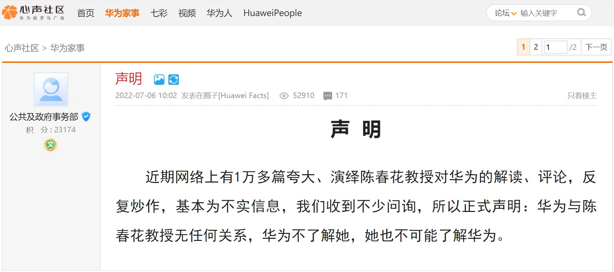

% 华为与陈春花到底怎么了？
% 王福强
% 2022-07-07

看到这种声明感觉还挺突兀的，不高明：

参照刘润老师的公众号内容，大体上知道了怎么回事。

说说个人之前肤浅的猜想...

从华为角度来看，华为做出这种举动显然是因为自己的权重被蹭了， 一次我可以忍，再三再四肯定不能忍，只不过，这公告水平需要提高下，比如“继续欢迎陈春花老师与上次xyz作为学者一起再次光临交流”之类，是不是好一点儿呢；）

从陈春花的角度来看，别人言过其实的东西，我肯定保持沉默啊，享受泡沫的红利不好吗？ 我自己只要没说过，别人怎么说，那是别人的事情，跟我个人节操一点儿关系没有啊，而且还帮我做了营销，何乐而不为呢？ 盛名难不难副有什么关系？ 又不是我自己说的... 就好像我说我是万年P8，有朋友说我水平到今天应该P11，我tmd说啥了吗？ 我肯定不会自己说我tmd是P11对不对？！ 

从盗版链条的角度来看， 其实也无非就是图点儿利，从版权的角度来看，他们肯定不地道，从商业的角度，却不能说对华为和陈春花没有益处， 盗版链条除了自己获益，其实也为双方做了传播，创造了营销价值。 

所以我说，这个事情其实处理的并不高明，你觉得呢？ ；）

