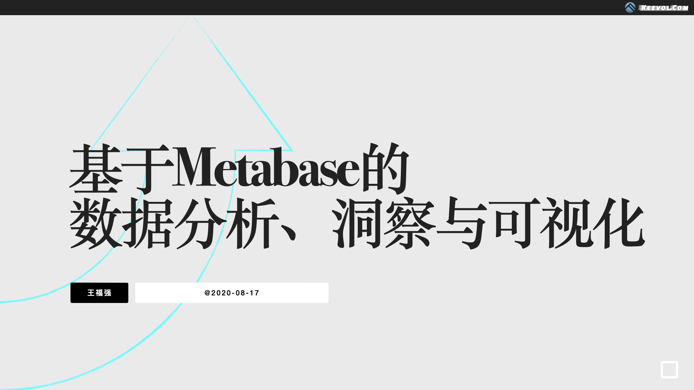

% 双十一特惠课程发售 - 最新《使用Metabase做自助数据分析与数据可视化》录播课
% 王福强
% 2022-11-10

你是否遇到这样一些的困扰？

- 身为研发，天天被产品催数据分析结果？
- 身为产品，天天等研发拉数据、出报表？
- 身为运营，没有数据驱动的平台支持？
- 身为CEO，却发现企业数字化转型举步维艰？

或许，该考虑升级数据思维和工具了。

metabase，快速拉数据，快速建报表， 快速出数据分析结果，咱要不试试？

来，双十一特惠课程，快快快： <https://wfq.gumroad.com/l/metabase>

