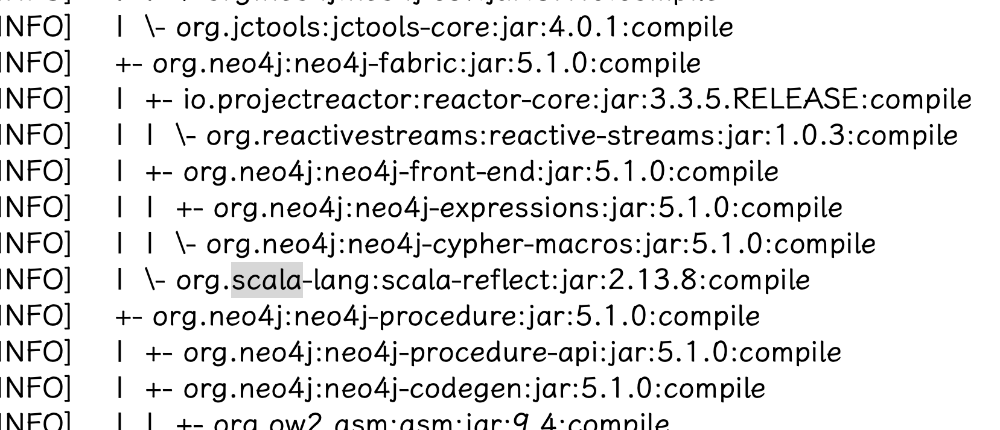

% It sucks to embed neo4j when using scala 2.12.x
% 王福强
% 2022-11-16

I would like to play with a single node graph database, so neo4j comes first.

I write code in scala 2.12.x for years, even today, and I try to embed neo4j because I just want to play with it instead of putting it into production. (I know, I know,  client-server mode is also easy as pie)

Then shit happens...

The first trap is scala dependency issue: 

Why it always loads scala-reflect 2.13? But I am so sure that I have configured 2.12 explicitly in scala-maven-plugin! 

- Is it a problem with IntelliJ Idea?
- Is it a bug of scala-maven-plugin?
- Or am I using wrong version of JDK?

Damn, it cost me a morning and finally I find the culprit: neo4j dependes on scala 2.13 transitively. 

So what we do? exclude it!

Re-run, Bang, NoSuchMethodFound error from log4j!

R u kidding me? 

exclude and replace with new version of log4j.

Re-run... Oops... Guess what? Scala issue came again. This time, scala collection issue. You know some collection APIs of scala 2.12 and scala 2.13 are different, right? 

Fuck off, I turn to client-server mode!

