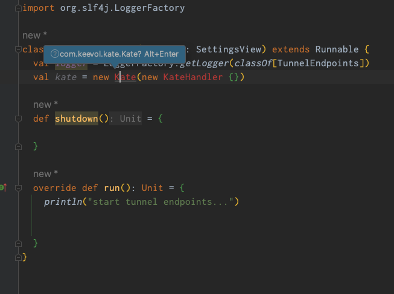

% Maven3与Maven2的不兼容问题
% 王福强
% 2023-03-14



问题是从Intellij IDEA里代码补全功能失灵开始的， 开始既怀疑了是新升级了IDE版本的问题，也怀疑了是新升级的Scala插件的问题，最后才发现，是他妈的Maven的问题...

# 排错原理与解决方案

Maven3.x版本之后，添加了新的元信息文件`_remote.repositories`, 导致我本地`mvn clean install`的artifact在IDE和maven编译的时候找不到。

虽然这个机制解决了一部分问题（一些group:artifact冲突的问题）， 但也不应该出现这样的结果啊！

解决方案就是移除这个元信息文件，可以只移除某个artifact的，也可以都移除，比如使用如下命令：

```
cd ~/.m2
find . -name "_remote.repositories" -type f -delete
```

oneliner也有： `find ~/.m2/repository -name _remote.repositories -exec rm -v {} \;`

在Maven3的前期版本中，有些时候元信息文件名称是`_maven.repositories`，所以，也有用如下命令的资料：

```
find ~/.m2/repository -name _maven.repositories -exec rm -v {} \;
```

作者遇到这问题的时候是3.8.2：

```
LuckinJohn ➜  youtubemp3 git:(master) ✗ mvn --version
Apache Maven 3.8.2 (ea98e05a04480131370aa0c110b8c54cf726c06f)
Maven home: /Users/fq/bin/apache-maven-3.8.2
Java version: 19.0.2, vendor: Oracle Corporation, runtime: /Users/fq/Library/Java/JavaVirtualMachines/openjdk-19.0.2/Contents/Home
Default locale: en_US, platform encoding: UTF-8
OS name: "mac os x", version: "13.2.1", arch: "x86_64", family: "mac"
```

但每次mvn install之后都手工去移除这个文件也挺烦躁的，所以，除了手工移除元信息文件的方式，还有一个方式可以避免本地install的库识别不了的问题，那就是在执行`mvn clean install`的时候加上一个参数： 

```
mvn clean install -Daether.enhancedLocalRepository.trackingFilename=_ignore_remote.repositories
```

这个参数的效果就是，生成一个名称为`_ignore_remote.repositories`的元信息文件，而不是默认的`_remote.repositories`，这样，maven3也不会出现识别不了本地新install的库的问题。 


当然，这个文件名可以随便写，只要不是`_remote.repositories`就行。


# 题外话

今天还遇到几个tricky的问题：

## spring boot版本过低的问题

```
2023-03-14 20:32:11,708 WARN  [main] o.s.c.a.AnnotationConfigApplicationContext - Exception encountered during context initialization - cancelling refresh attempt: org.springframework.beans.factory.BeanDefinitionStoreException: Failed to read candidate component class: URL [jar:file:/Users/fq/workspace.keevol/KeeboxNative/target/keeboxfx-1.0.0-SNAPSHOT.jar!/BOOT-INF/classes!/com/keevol/keebox/annotations/ConfigSetting.class]; nested exception is org.springframework.core.NestedIOException: ASM ClassReader failed to parse class file - probably due to a new Java class file version that isn't supported yet: URL [jar:file:/Users/fq/workspace.keevol/KeeboxNative/target/keeboxfx-1.0.0-SNAPSHOT.jar!/BOOT-INF/classes!/com/keevol/keebox/annotations/ConfigSetting.class]; nested exception is java.lang.IllegalArgumentException: Unsupported class file major version 63
2023-03-14 20:32:11,755 ERROR [main] o.s.boot.SpringApplication - Application run failed
org.springframework.beans.factory.BeanDefinitionStoreException: Failed to read candidate component class: URL [jar:file:/Users/fq/workspace.keevol/KeeboxNative/target/keeboxfx-1.0.0-SNAPSHOT.jar!/BOOT-INF/classes!/com/keevol/keebox/annotations/ConfigSetting.class]; nested exception is org.springframework.core.NestedIOException: ASM ClassReader failed to parse class file - probably due to a new Java class file version that isn't supported yet: URL [jar:file:/Users/fq/workspace.keevol/KeeboxNative/target/keeboxfx-1.0.0-SNAPSHOT.jar!/BOOT-INF/classes!/com/keevol/keebox/annotations/ConfigSetting.class]; nested exception is java.lang.IllegalArgumentException: Unsupported class file major version 63
```

升级了最新版本后，过。

但后来发现退出程序的时候，spring boot的生命周期与bean的生命周期一直错配导致异常，虽然是退出程序，但看着还是碍眼，最后，直接把spring boot全部干掉，毕竟，KEEBOX是个桌面程序，其实不需要spring boot这种服务器端框架。 

## vertx版本冲突问题

报错类似于：

```
java.lang.NoSuchMethodError: 'void io.vertx.core.http.HttpServerResponse.end(java.lang.String)'
```

看有人提示是[版本不一致问题导致](https://stackoverflow.com/questions/72474444/nosuchmethoderror-in-vertx-when-hitting-an-api)的，遂`mvn dependency:tree`了一把，然后查看依赖vertx的类库有哪些，最后发现老早开发的kapi依赖用了老的3.x.x版本的vertx，移除之后搞定。


