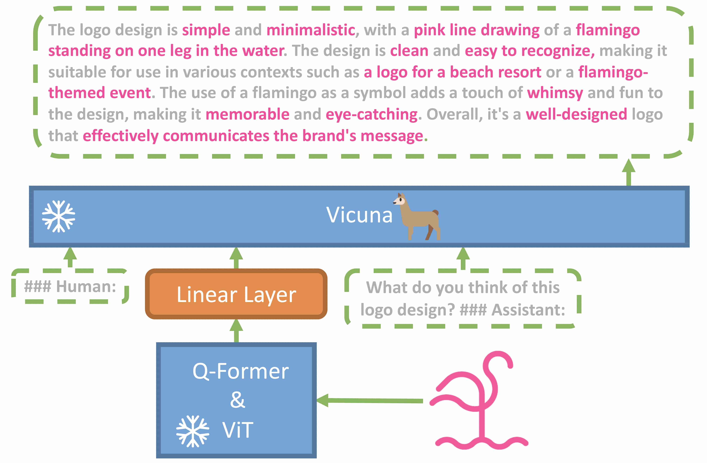

% truthgpt、MiniGPT和StableLM
% 王福强
% 2023-04-20

# 马斯克的x-ai公司发布[truthgpt](https://talk.truthgpt.one/)

马斯克是OpenAI最早的投资人，后来退出之后微软与OpenAI走在了一起，马斯克“觉得”现在的OpenAI违背了初心，所以，新搞了现在的x-ai公司并发布了truthgpt。

# [MiniGPT](https://github.com/Vision-CAIR/MiniGPT-4)

MiniGPT是一个Vision-Language模型，简单来说，其实就是“看图说话”。它通过BLIP-2模型 ^[还记得扶墙老师在[《ComfyUI从入门到精通》](https://wfq.gumroad.com/l/comfyui)里提到的CLIP模型吗？跟BLIP-2属于一类模型]，可以通过输入图片获取文字，然后再通过Vicuna大语言模型生成更为详尽的图片描述。

表象上看是可以理解图片，实际上就是通过图片与文字标注的映射再加一层大语言模型的生成来输出文字描述。

# Stability开源大语言模型[StableLM](https://github.com/Stability-AI/StableLM)

大家都知道Stable Diffusion是AIGC赛道上著名的文字生成图片的开源方案，而Stability则是Stable Diffusion背后的公司，本周Stability同时开源了他们自己的大语言模型-StableLM。

> TIP
>
> 上周，[Databricks公司（俗称“砖厂”）也发布了他们的大语言模型Dolly 2.0](https://techcrunch.com/2023/04/12/databricks-dolly-2-generative-ai-open-source/)

