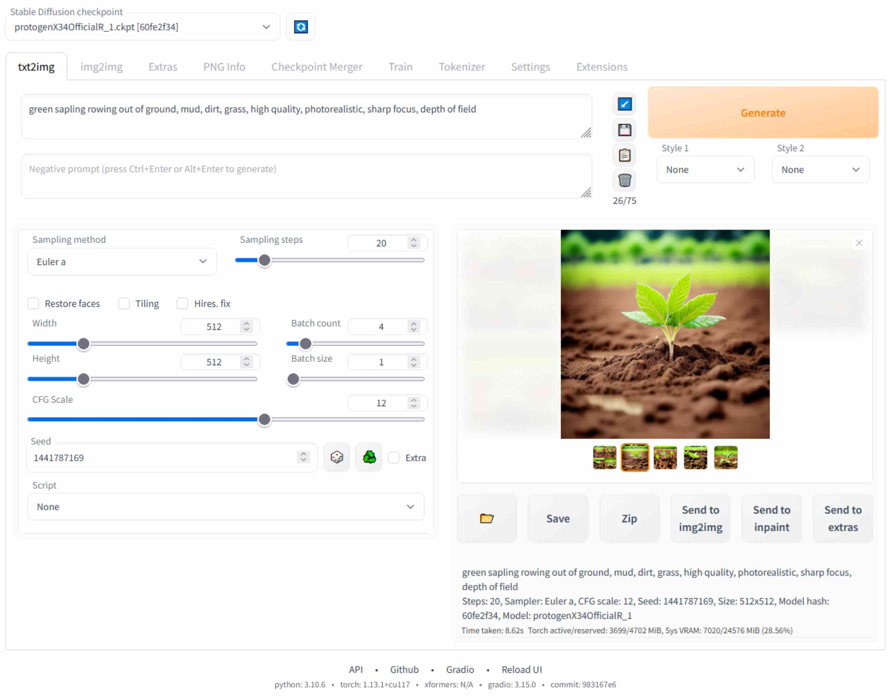
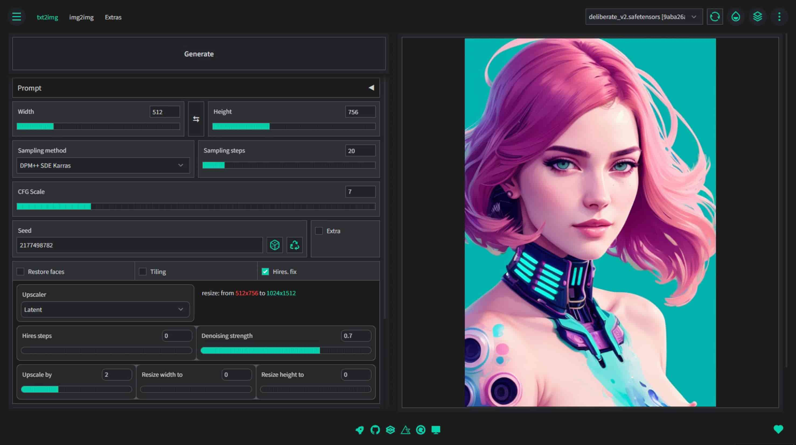
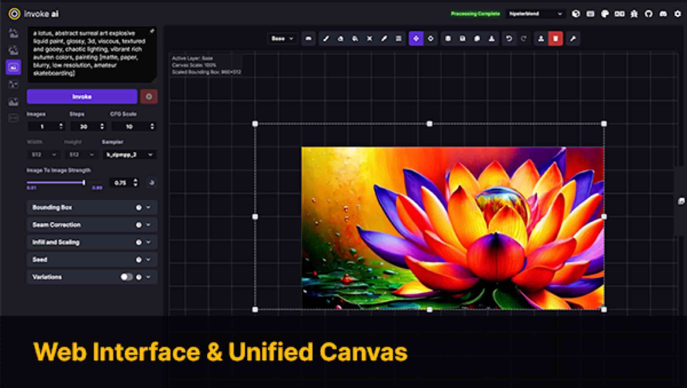
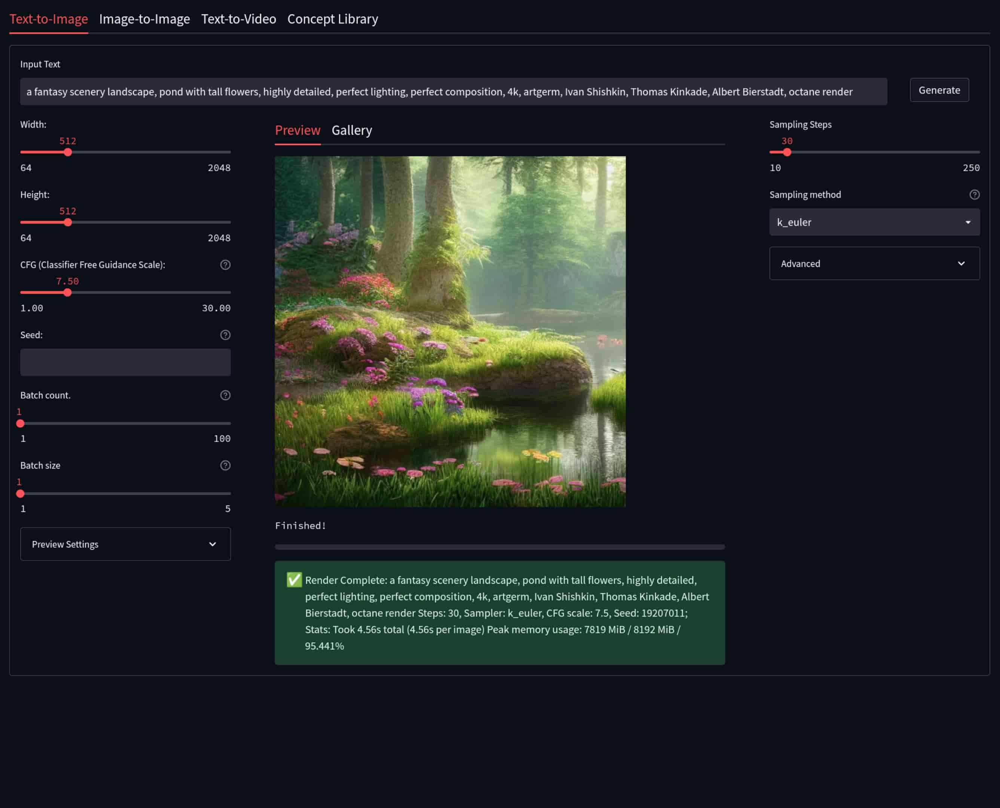
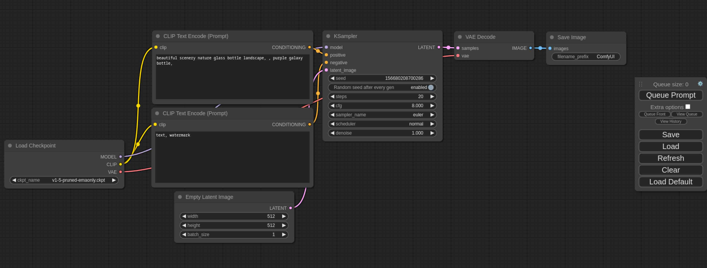
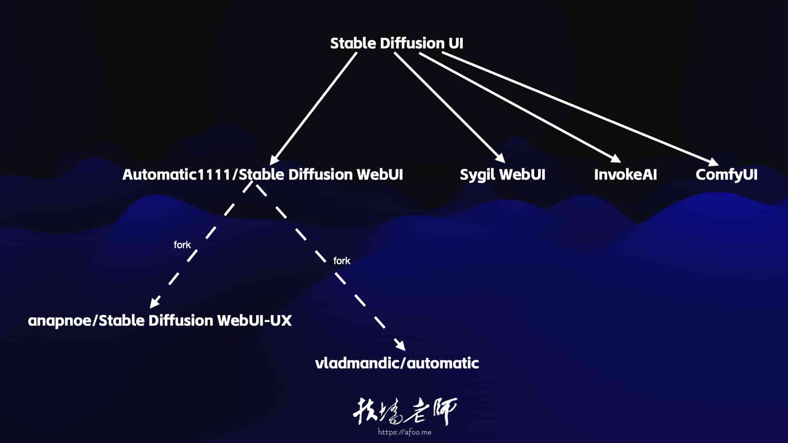

% 不知道Stable Diffusion Web UI应该怎么选？ 看这一篇就够了！
% 王福强
% 2023-04-29

> 不想看文字？ 视频在这里：<https://www.youtube.com/watch?v=8tWR2zn23Pc>

Stable Diffusion是当下AI绘画开源领域里（文字生成图片）最火的模型了，但是，从底层写python代码调用Stable Diffusion，对于大多数人来讲难度有些大，所以，如果有一种应用，可以让我们简单输入文字，然后点一点就可以出图，那是不是就像是“困来就来枕头”那般爽呢？你还别说，真有，今天扶墙老师就给大家系统化地梳理一下有哪些好的Stable Diffusion Web UI产品。

# Automatic1111 Stable Diffusion WebUI

这是现在使用最广的一个Stable Diffusion Web UI，功能全，可扩展性还强，几乎所有的媒体和视频教程都有它的身影，要玩Stable Diffusion，它是起步门槛最低的选项。 对于素人来说，墙裂推荐。

## Anapnoe Stable Diffusion WebUI-UX

属于Automatic1111 Stable Diffusion WebUI的一个分叉（Fork），提供了更加清爽的UI界面：

## Vladmandic Stable Diffusion WebUI

一般简称Vlad WebUI，也是属于Automatic1111 Stable Diffusion WebUI的一个分叉（Fork），同样是在UI和风格上做了调整，长这个样子：

## Cagliostro Colab UI

这个确切地说，不能跟以上算作一类，它只是提供了Colab Notebook，让大家可以更简单的运行Automatic1111 Stable Diffusion WebUI或者Anapnoe Stable Diffusion WebUI-UX

# InvokeAI

另一种开源的Stable Diffusion Web UI类产品，长这个样子：

# Sygil WebUI

长这个样子：

# ComfyUI

入门门槛比较高的一种Stable Diffusion Web UI产品，通过flow的形式构建文字生成图片的执行流程，对于理解Stable Diffusion模型有很大的帮助，在特殊场景下，可以加快迭代与重用过程，它一般长这个样子：

# 小结

最后，对以上产品做个梳理小结：

对于大多数同学来说，选择Automatic1111 Stable Diffusion WebUI入门是比较合理的，写这篇文字也是因为之前有同学买了「[扶墙老师讲Stable Diffusion系列](https://wfq.gumroad.com/l/fb)」的第三部分ComfyUI，发现从搭建环境到可以运行起来，对于没有技术基础的同学来说还是有很大的门槛效应，所以，不建议一上来就用ComfyUI，更建议从Automatic1111 Stable Diffusion WebUI或者其它几个常规UI设计的产品起步，等有一定的经验和理解力之后，再去接触ComfyUI，当然，到时候也欢迎看看「[扶墙老师讲Stable Diffusion系列](https://wfq.gumroad.com/l/fb)」，其中包含了从入门到精通的精品内容，比如：

1. [《Stable Diffusion入门》](https://www.youtube.com/watch?v=D7hzPVo_leI)
2. [《Stable Diffusion进阶》](https://wfq.gumroad.com/l/sd2)
3. [《ComfyUI从入门到精通》](https://wfq.gumroad.com/l/comfyui)
4. [《LoRA模型训练实操》](https://wfq.gumroad.com/l/lora)

Have Fun～

---

补充@2023-04-30:

[Radiata](https://github.com/ddPn08/Radiata)是一个新的StableDiffusion UI，基于diffusers和[DeepFloyd IF](https://deepfloyd.ai/deepfloyd-if)模型开发，使用TensorRT加速。如果想要更详细的了解，可以看看福强老师的[解读](https://youtu.be/yXInC23J0Qk)：

> StableDiffusion Web UI又添一员猛将Radiata,那么,它有什么特殊之处呢? #扶墙老师讲StableDiffusion系列 <https://youtu.be/yXInC23J0Qk> 来自 @YouTube 

