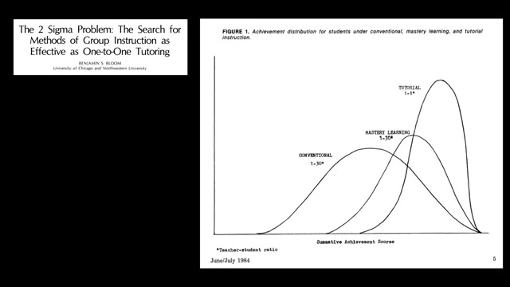
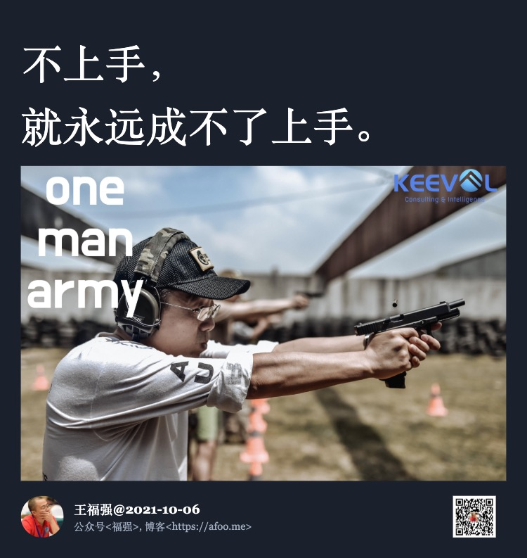

% ChatGPT加持的可汗学院为什么更牛逼?
% 王福强
% 2023-05-06

可汗学院的创始人可汗(Khan)最近在TED上的演讲引起很多人的重视，现场演示的效果也很棒，大家感兴趣可以自己去[B站观看](https://www.bilibili.com/video/BV1Xa4y137rR/?share_source=copy_web&vd_source=db3aefcc7c6a2d0e426da691e12a8d59)（油管上TED的官方频道当然也有）

>【可汗学院创始人Khan最新TED演讲：GPT-4作为AI学习私教，可能带来教育史上最大变革（双语版本，人机共创）】 https://www.bilibili.com/video/BV1Xa4y137rR/?share_source=copy_web&vd_source=db3aefcc7c6a2d0e426da691e12a8d59

这里扶墙老师只是简单说两点自己的感受...

# 1V1

私教或者说一对一真人辅导的作用，其实早在1984年就有很多研究表明，效果要优于“大锅饭”，其实自己想想都能想明白的事儿，研究无非也只是找几个指标画画图，有人传帮带，跟自己东突西撞地瞎摸索，效果和时间成本上都是巨大的差异，最终导致巨大的差距。

有一天跟同余科技的cofounder吃饭，饭桌上他就表达了类似的一个观点，说白了他能快速成长甚至他的当年职场领导能快速成长，无非就四个字： “**言传身教**”， 本质上就是有个一对一的人带你，你有了一个“私教”。

我们经常抱怨传统教育都是死记硬背，但我发现其它地区的教育，更多强调的却是muscle memory，为什么？ 因为只有先强调muscle memory才能做到切身体察，而你不上手，就永远成不了上手！

靠自己死记硬背的下场就是ChatGPT出来之后，直接碾压，因为它靠死记硬背达成的能力，远比你一个人更强。

- 算投入，你没它投入大（每天几十万美金上百万美金的烧）；
- 算算力，你也没它算力强；
 
所以，死记硬背是没有前途的，还不如把这个东西委派给ChatGPT，然后让它做你的助手或者私教，与其想要靠个人能力和精力做得比ChatGPT更好，不如做个不一样的自己；）

# Context Matters (a lot)

我觉得这张图是整个演讲中比较精华的部分，整个演讲效果再好，那都是表象，但背后发生了什么，需要靠这张图才能了解。

为了达到演讲的最佳效果，可汗学院在现有的模型基础上，对数学领域的知识进行了6个月的调优，同时还有很长时间的模型微调，那怎么调优，怎么对模型微调？ 关键就是一个词：**Context** ！

**上下文信息（Context）是发挥GPT模型“超能力”的关键**，单纯给ChatGPT一个简单的指令当然可以，在相对简单和明确的场景下，比如单词翻译，它确实可以给你很好的答复，但相对复杂的场景下，想要达到很好的效果，就需要给它更多的上下文信息。

昨天很晚了跟一位副主任医师聊AI，然后给他几个ChatGPT的入口做体验，给的反馈差强人意，原因就在于，他并没有把更多、更详细的上下文给到GPT。这其实就跟我们写稿子、写PPT一样，要经历多个版本的迭代（revision iteration）才能收获比较好的结果一样，`上下文-结果-修正-反馈`，多个循环下来，才可以得到一个相对满意的结果。 

所以，ChatGPT并非像很多人想象的那样无所不知，甚至成为你“肚子里的蛔虫”，其实，它更像**一个“器”、一面镜子**，能给你什么，更多看你自己；）

想要用好ChatGPT，prompt怎么起草还是要多少学一下的，有工具辅助当然更好，但大体的思路和限制要清楚。 其实，**prompt本质上也是一种模型的微调（fine tune）， 只是更为泛化、低频的微调，而不是集中特定的微调。**

---

最后做个广告，如果想要了解更多AI的知识和工具，包括但不限于GPT、AI绘画等领域， 欢迎加入『为AI疯狂』知识星球，这里除了及时新鲜的AI资讯，还有近300分钟的付费课程，加入星球即可免费获取: 

