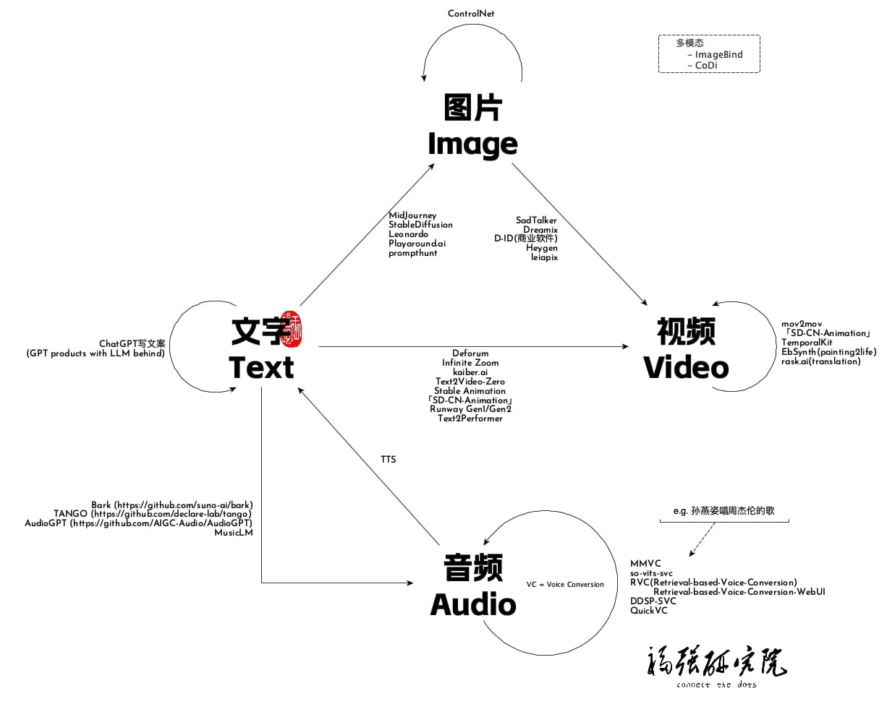

% 福强AI课堂Stable Diffusion系列结课啦～
% 王福强
% 2023-06-02

截至2023年五月最后一天，福强AI课堂(<https://edu.afoo.me>) 全新创作的Stable Diffusion系列课程已经完成，加上之前的ChatGPT内容，已经直奔500分钟而去，我们始终相信，如果说MidJourney是为小白素人准备的图片生成神器，那么Stable Diffusion则一定是设计与摄影专业人士手中的大宝剑，善假于器才能在新的时代里披荆斩棘，精品，一定是非标准化作业的产物，这种灵活度，只有Stable Diffusion才能给你 ；）

**知其然，知其所以然**，二者并重，方为上手！这也是整个系列的内容“从理论到实践”始终坚持的一贯宗旨。

福强AI课堂 Stable Diffusion系列课程内容现包含：

1. Stable Diffusion入门
2. Stable Diffusion进阶
   - Intro to Stable Diffusion (什么是Stable Diffusion）
   - How Stable Diffusion Works （Stable Diffusion原理与分析）
   - How to figure out what kind of model do（Stable Diffusion的各种Model类型如何区分和使用）
   - How to customize models?（如何定制Stable Diffusion的模型）
   - is there any better models? （有没有比Stable Diffusion更好的模型）
   - Product ecosystem of stable diffusion （Stable Diffusion产品生态介绍与分析）
   - Auto1111 Stable Diffusion WebUI deep intro （深入了解Auto1111 Stable Diffusion WebUI）
   - How to be a prompt engineer? （如何成为一名合格的prompt工程师）
   - Commercial scenarios & applications （Stable Diffusion的商业场景及应用）
3. ComfyUI从入门到精通
   1. 什么是ComfyUI
      	- 了解Node产品设计
      	- 了解Block产品设计
   2. 对比ComfyUI与Automicatic1111 WebUI
   3. 安装与运行
   4. 基础用法
   5. 架构解析
   6. 高级用法
      	- Img2Img
      	- unCLIP
      	- Upscale
      	- Hires Fix
      	- Inpaint & Outpaint
      	- LoRA
      	- Textual Inversion
      	- ControlNet
      	- 多区块长图片拼接与生成
      	- Grid与XYZ Plot
   7. 自定义扩展
   8. 产品化与商业化思考
   9. 参考阅读
4. 如何训练LoRA模型
   1. 垂直行业场景案例展示
   2. LoRA模型概念与原理回顾
   3. LoRA模型训练过程讲解
   4. lyCORIS模型介绍
   5. LoRA模型训练实操演示
   6. Q&A
5. 深入浅出ControlNet
   1. 什么是ControlNet
   2. T2I Adaptor附带讲解
   3. ControlNet架构讲解
   4. ControlNet 14种模型深入详细讲解
   5. ControlNet的使用原则与场景探讨
   6. Q&A
6. Inpainting与Outpainting
   1. 什么是Inpainting或者Outpainting?
   2. Inpainting主要解决什么问题
   3. Inpainting实操演示
   4. Inpainting相关参数详解
   5. Inpainting与AIGC精品创作流程与最佳实践
   6. Outpainting常见思路与实践
   7. 关于Inpainting模型的必要补充
   8. Q&A
7. LatentCouple与组合一体化生成
   1. Latent Couple的起源（介绍三种概念之间的密切关系）
       - Composable Diffusion
       - Latent Couple
       - Composable LoRA
   2. Regional Prompter与LatentCouple的异同
   3. LatentCouple相关参数详解
   4. LatentCouple辅助工具
   5. LatentCouple实操与演示
   6. Q&A

8. MultiDiffusion
   1. 什么是MultiDiffusion？
   2. MultiDiffusion有啥用？
   3. MultiDiffusion怎么用？
   4. MultiDiffusion实操演示
   5. Q&A
9.  Stable Diffusion中的光线控制（LightControl）
    1. 光线类型简介与布光模式入门
    2. 基于Prompt的光线控制
    3. 基于参考图片的光线控制
    4. 光线控制的实操演示
    5. Q&A
10. 如何使用Stable Diffusion和AI工具创作视频
    1. AI视频到应用场景与发展历程介绍
       1. 图文成片
       2. 虚拟数字人
       3. 第一代换脸
       4. 第二代换脸
       5. 第2.5代换脸
       6. 第三代换脸
    2. 理解视频基本概念与原理
    3. 通用视频创作工具
    4. AI视频创作工具
       1. 商业工具
       2. 开源工具
    5. StableDiffusion视频创作生态
       1. 从文字生成视频理论与实操演示
       2. 从图片生成视频理论与实操演示
       3. 从视频生成视频理论与实操演示
    6. 非标准视频创作思路与工具
    7. Q&A

除此之外，关于Stable Diffusion的部分公开课内容也可以在扶墙老师的油管频道里找到，包括：

- 如何选择各种Stable Diffusion的WebUI产品
- 如何训练刘亦菲的LoRA模型
- Auto1111 Stable Diffusion WebUI不可不知的三个技巧

另外就是关于2023年大火的大语言模型（LLM）， 福强AI课堂中也提供了两堂有关ChatGPT的解读，更多大语言模型和生成式AI的内容，则可以在「为AI疯狂」知识星球里获取：
 
- 扶墙老师讲透ChatGPT
- 十分钟极速了解GPT生态

以上所有内容都可以通过[加入「为AI疯狂」知识星球](https://t.zsxq.com/0dI3ZA0sL)直接获取，属于星球成员的独享福利。

