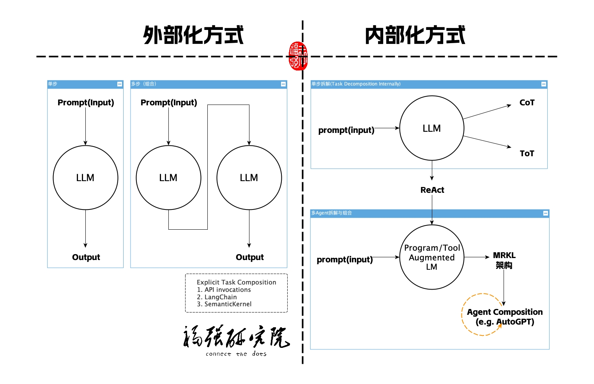

% LLM框架与应用要解决的问题的本质
% 王福强
% 2023-06-28

做了三期有关LLM Orchestration框架与应用设计与开发的节目:

1. [LangChain极简揭秘](https://youtu.be/H5lSlWjOePo)(https://youtu.be/H5lSlWjOePo)
2. [Semantic Kernel极速揭秘](https://youtu.be/OvNey1tAGJE)(https://youtu.be/OvNey1tAGJE)
3. [ChatGPT with Scala](https://youtu.be/3km1LznvqvY)(https://youtu.be/3km1LznvqvY)

如果我们做个简单回顾的话，其实可以发现，这些框架和应用设计开发的模式无法就是按照三阶段递进的思路进行，这三个阶段我简单这样划分：

1. LLM外部化组合协调
2. LLM内部化分解与组合协调
3. 对LLM增强的外部化能力整合与协调

而且，这三个阶段有一条唯一的主线， 那就是Prompt Engineering。 所有的能力“召唤”其实都是通过Prompt进行的，但如何挖掘Prompt的潜力，这就是Prompt Engineering的主战场了，Prompt Engineering探索出来的思路和方法，最终变成日常使用的一些prompt技巧（tips&tricks）。

# LLM外部化组合协调

通过程序去调用LLM（传入prompt作为输入），然后把返回的结果再作为输入传给下一个LLM，这样的组合协调是在LLM之外进行的，所以，我称这种方式是“LLM外部化组合协调”， LangChain里的Chain，Semantic Kernel里的Functions，甚至作为一般化手段的Scala通过API去调用ChatGPT，其实都是“LLM外部化组合协调”的方式。

# LLM内部化分解与组合协调

对于复杂的任务来说，我们需要通过一些prompt的技巧让LLM可以在模型内部做退到（reasoning）， 常见的方法或者技巧有CoT（Chain of thought）以及ToT（Tree of Thought）甚至ReAct（Reasoning + Actions）。 

但这种方式有个弊端，那就是它再怎么自动化，再怎么“智能”，它都是在一个相对封闭的环境中进行的，也就是说，模型的版本和参数限定了它的边界，无论如何将复杂系统做分解（Task Decomposition），都只是在一个相对封闭的环境里做“内循环”，有些时候，这样玩其实就是无解。

所以，我们亟待寻求其它方式来解决这个问题，那就是...

# 对LLM增强的外部化能力整合与协调

这种方式寻求LLM之外的能力介入来增强LLM的能力，常用的方式有：

1. Program-aided LM
2. Tool argumented LM

ChatGPT的plugins机制，其实就是这样的玩法，LangChain的Tool/Toolkit、SemanticKernel的Native Functions，也都是属于这一类。 

通过引入外部的程序和工具来增强原有大语言模型， 从而让基于大语言模型的应用拥有更为灵活的调度协调能力，当然，更总要的是，可以与外界环境进行实时的通信，从而无缝的融入现有的环境和生态当中。

LangChain的Agent和Semantic的Planner以及像AutoGPT等项目和功能，它们都属于这一类，而且通常会采用一种叫MRKL的架构来构建，本质上来说，它们有了`任务分解` + `外部能力调用`两种能力的加持。

OK, 那以上就是对前面三期节目的小结，希望对大家有帮助。 

想要了解更多AI、AGI以及AIGC的干货内容，也欢迎来<https://edu.afoo.me>看看或者加入[「为AI疯狂」知识星球](https://t.zsxq.com/0dI3ZA0sL)(https://t.zsxq.com/0dI3ZA0sL)。

