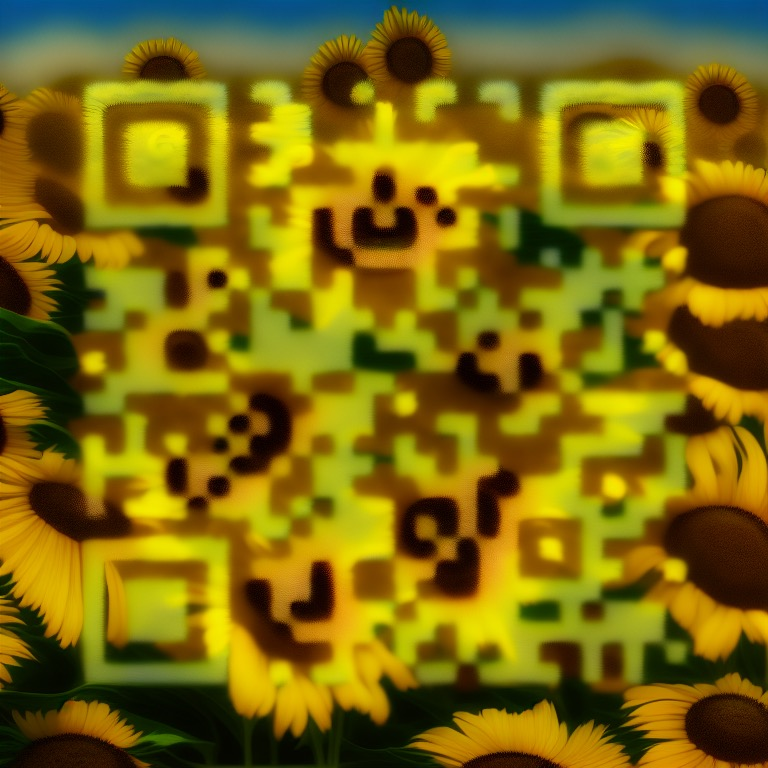

% 生成艺术二维码的三种套路
% 王福强
% 2023-07-05

啥？ 艺术二维码你还没听说？ 其实就是随着AIGC尤其是Stable Diffusion的兴起而出现的一种新的二维码形式，像下面这样（效果有比这惊艳太多的），既像二维码，又与生成的图片合二为一融为一体：



**第一种套路** 是直接用网上别人搞的SaaS，比如Huggingface上别人开放的[demo space](https://huggingface.co/spaces/huggingface-projects/QR-code-AI-art-generator)， 或者加入别人提供的Discord服务器，这个就比较多了，各位感兴趣自己搜下；）

**第二种套路** 当然就是走我们大名鼎鼎的Stable Diffusion了，只不过， 走Stable Diffusion其实也有至少两种套路：

1. [img2img + controlnet](https://stable-diffusion-art.com/qr-code/)
2. controlnet + controlnet

现在用的最多的是第二种，也就是两个controlnet串联， 第一个一般用[brightness](https://huggingface.co/ioclab/ioc-controlnet/blob/main/models/control_v1p_sd15_brightness.safetensors)这个control net，主要用来调节颜色或者重新着色， 第二个一般用tile这个controlnet，目的是增减细节，这个特性在 [扶墙老师讲Stable Diffusion系列（5）- 深入浅出ControlNet](https://edu.afoo.me/) 里提到过。

通过在两个controlnet的控制权重与范围这两个或者一个参数之间平衡，就可以生成融合了生成图像的二维码了，只不过这个试错的过程通常比较耗费时间，所以，大家如果要自己玩，最好先去搜一下前面别人实验之后的参数值做参考，否则，自己从头试错，有些时候还是挺有挫败感的，比如，[这里就是很多残次品](https://keepoints.feishu.cn/docx/ZxMndkpwRoongpxAUcbcUn9xnad)(https://keepoints.feishu.cn/docx/ZxMndkpwRoongpxAUcbcUn9xnad)，而这也是只是几百张里挑出来的好看点儿的，但依然不能扫成功，要从生成结果中筛选出既漂亮（有创意性）还能扫码成功（有识别度）的，那就更是难上加难了。

**第三种套路** 其实有点儿勉强，原因是我在用自己脚本启动和执行Automatic1111 Stable Diffusion WebUI的时候，其实brightness这个controlnet的模型报错：


```
Total progress: 100% 20/20 [00:03<00:00,  6.53it/s]
2023-07-05 06:18:14,882 - ControlNet - INFO - Loading model: control_v1p_sd15_brightness [e3b0c442]
*** Error running process: /content/stable-diffusion-webui/extensions/sd-webui-controlnet/scripts/controlnet.py
    Traceback (most recent call last):
      File "/content/stable-diffusion-webui/modules/scripts.py", line 474, in process
        script.process(p, *script_args)
      File "/content/stable-diffusion-webui/extensions/sd-webui-controlnet/scripts/controlnet.py", line 742, in process
        model_net = Script.load_control_model(p, unet, unit.model, unit.low_vram)
      File "/content/stable-diffusion-webui/extensions/sd-webui-controlnet/scripts/controlnet.py", line 303, in load_control_model
        model_net = Script.build_control_model(p, unet, model, lowvram)
      File "/content/stable-diffusion-webui/extensions/sd-webui-controlnet/scripts/controlnet.py", line 331, in build_control_model
        state_dict = load_state_dict(model_path)
      File "/content/stable-diffusion-webui/extensions/sd-webui-controlnet/scripts/utils.py", line 20, in load_state_dict
        state_dict = safetensors.torch.load_file(ckpt_path, device=location)
      File "/usr/local/lib/python3.10/dist-packages/safetensors/torch.py", line 259, in load_file
        with safe_open(filename, framework="pt", device=device) as f:
    safetensors_rust.SafetensorError: Error while deserializing header: HeaderTooLarge
```

所以我就绕行了， 转而去启动了comfyui，然后挂了两个controlnet的方式，搞了一批艺术二维码，至于思路，那还是brightness这个controlnet加上tile这个controlnet的思路，毕竟，只要知其然知其所以然了，用啥都只是工具不是？！

---

最后做个广告，**如果你对Stable Diffusion如何创作感兴趣**，欢迎加入「为AI疯狂」知识星球同时获得 <https://edu.afoo.me> **上千分钟**的精品内容访问特权，其中包含了体系化的Stable Diffusion系列课程以及ChatGPT和大语言模型等前沿AI内容。 


