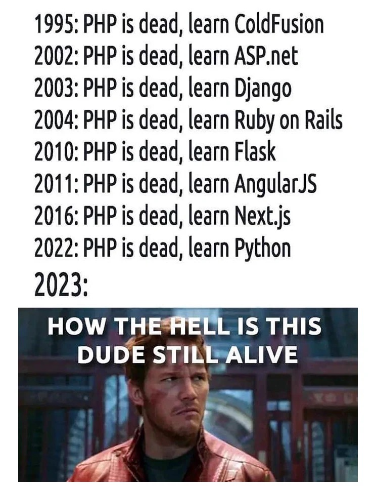

% PHP长盛不衰的秘密是什么？
% 王福强
% 2023-08-01

视频版：[Why PHP seems last forever？](https://youtu.be/gnIk2zf5yEg)(https://youtu.be/gnIk2zf5yEg)

昨天看到这张图，突然有了不一样的念头。虽然我知道这是一个meme，可以一笑而过，但仔细想想背后到底发生了什么，或许更有意思。

假如我看一下PHP的目标受众画像，那很大程度上会是数量庞大的中小企业（即SMB，Small Medium Business），甚至还有日渐增长的Solopreneurs？ 当然，我没有做过调研，也没有确切的数据，但如果这个假设成立的话，那就意味着从生态分布上来讲，PHP持续服务这生态分布中80%的中小企业以及Soloreneurs，所以，它看起来长盛不衰是有一定道理的。

进一步来讲， 每家企业其实也都会有自己的生命周期（这我在[《LoD Explained - LOD思维解释与案例》](https://wfq.gumroad.com/l/lod)(https://wfq.gumroad.com/l/lod)中也提过），每家企业都会从新生到消亡，假如对生命周期的各个阶段进行切段（处理）， 那么起步期为了快速开发上线，一定是选择简单且门槛低的技术，PHP是一个不错的选择。

而不管企业如何从新生到消亡，旧的去了，总会有新企业再诞生，个体上的消亡，不会影响生态分布的迁移，所以，PHP服务的客户画像也就不会出现大的偏移，这或许就是PHP可以长盛不衰的秘密？！或者说因素之一？！

