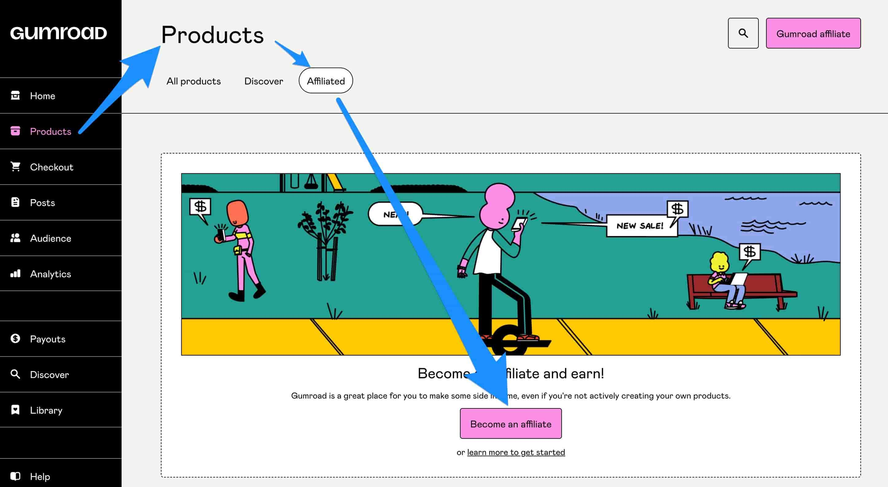
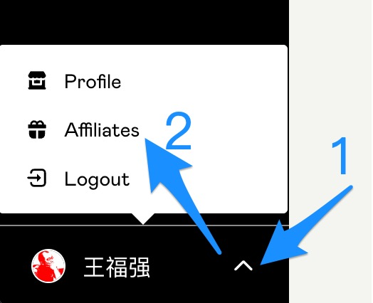
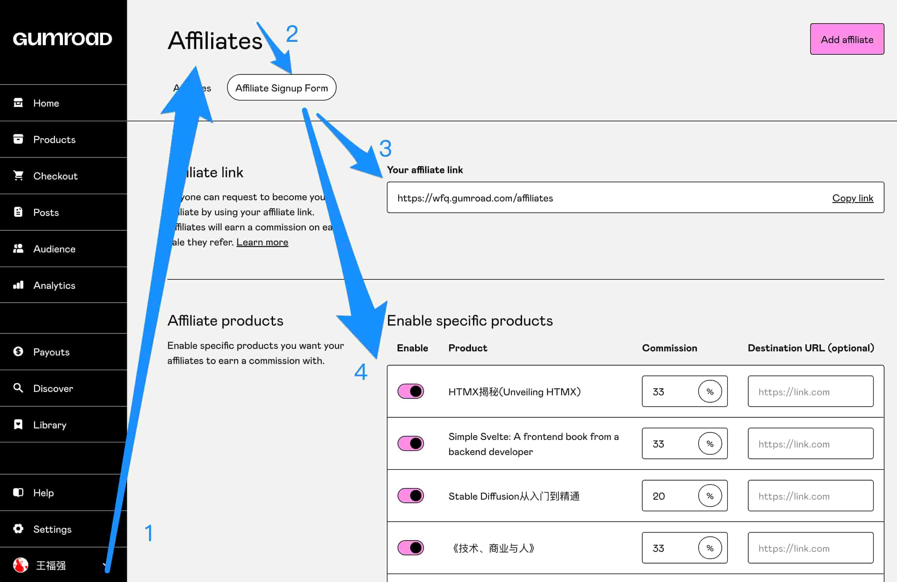

% Gumroad的分销功能看这篇就够了！
% 王福强
% 2023-08-17

Gumroad的分销机制主要分两种：

第一种类似国内的带货，针对单一产品，你如果觉得某个产品不错，那么，就可以只针对这个产品分享链接给自己的朋友或者朋友圈（😉），Gumroad会分配一个id用来关联产品销售与你之间的关系，7天有效期内产品售出，你可以分得10%的佣金。(如果觉得福强的产品不错（<https://wfq.gumroad.com>)，也欢迎各位老铁帮忙带带货呀～)

这个功能的入口在Gumroad后台的`Products -> Affiliated`:

第二种类似于代理商（现在好像喜欢称呼“超级个体”？）， 你可以申请成为某个创作者的affiliate（分销成员？分公司？），之后就可以代理这个创作者的所有产品了，一般每个创作者都会有一个独有的affiliate申请连接，比如福强的affiliate链接就是 <https://wfq.gumroad.com/affiliates>, 欢迎大家加入福强的联盟，一起为大家带去有价值的原创内容，“赠人玫瑰，手有余香（饷）”， 何乐而不为呢？

不过，从创作者角度来看，affiliate链接和产品分佣比例的管理这些功能的入口不太好找，这个功能入口是在Gumroad后台的个人资料（Profile）下拉菜单里：

点击Affiliates之后，就可以进入下面的页面，选择第二个Tab（Affiliate Signup Form），这个页面下可以管理创作者的[affiliate link](https://wfq.gumroad.com/affiliates)，并对要分销的产品进行管理，比如哪些产品开启分销，开启后，分佣比例设置为多少等：

针对[affiliate link](https://wfq.gumroad.com/affiliates)来说，创作者可以将其分享出去，然后假如有朋友感兴趣，就可以访问[affiliate link](https://wfq.gumroad.com/affiliates)并申请成为创作者的affilate（分销成员/公司）。

另外就是，假如有朋友主动找创作者要成为自己的affilate（分销成员/公司），创作者也可以在后台的这个页面右上角点击“Add affiliate”将之加入自己的affilate（分销成员/公司）。

