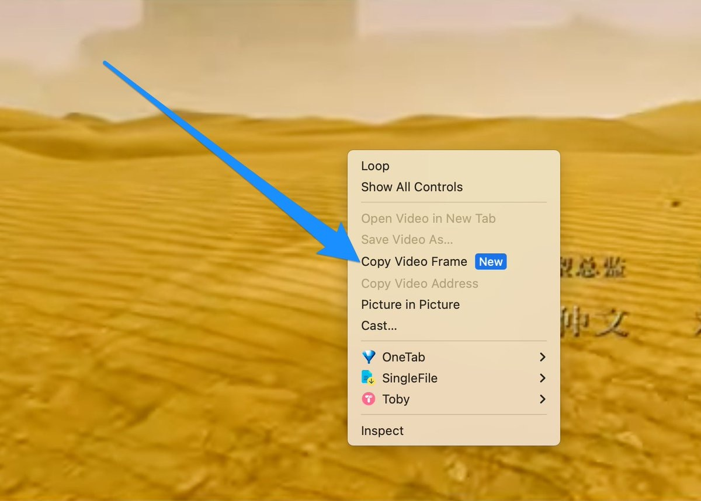
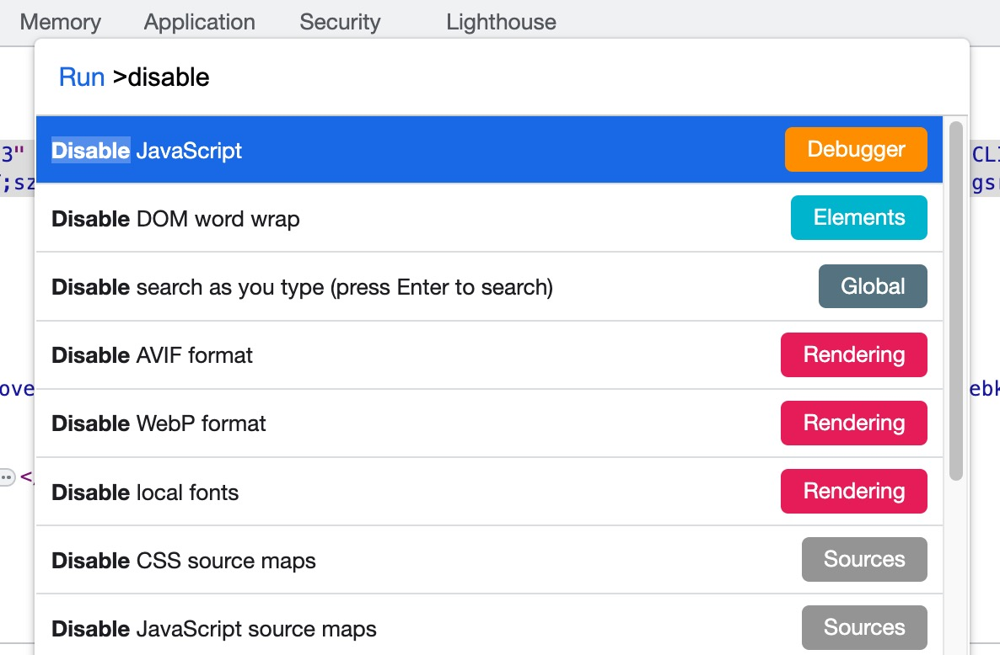
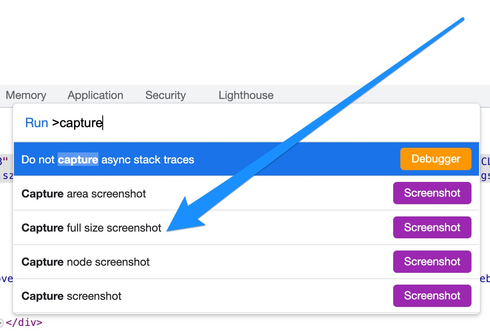

% Chrome浏览器让你欲罢不能的三个小技巧
% 王福强
% 2023-09-05

# 视频帧截图

原来看到视频中某个画面我们想截图留存的时候，一般会用系统的截图软件或者特定的chrome插件，现在不用了，最新的chrome浏览器里，我们只要连续两次鼠标右键，就可以调出类似如下的菜单：



选择`Copy Video Frame`，截图就到了系统剪切板了，随便你粘贴到哪里，是粘贴到微信的文件助手，还是发送个谁，又或者粘贴到哪个word文档...

# 解除页面文字复制的限制

有些网站会禁止用户复制页面里的文字内容，其实，对于开发人员来说没啥难度，对于普通用户来说，可能还有些难度。

原来有人给了这么个代码片段：

```js
const dontTreadOnMe = (e) => e.stopImmediatePropagation();
document.addEventListener('paste', dontTreadOnMe,true);
```

打开chrome的devtools，粘贴到Console里执行就可以了。

现在不用那么麻烦，打开devtools之后，`CTRL+Shift+P`(windows)或者`CMD + Shift + P`(Macos)调起Chrome到命令执行面板（Command Palette）， 输入`Disable`搜索出`Disable Javascript`然后回车就行了:



现在就可以复制了，谁tmd也拦不住老子；）

> NOTE
>
> 要恢复JavaScript，同样打开命令执行面板，搜索并执行`Enable Javascript`回车执行就可以了。

# 网页全屏截图

同样打开devtools之后，`CTRL+Shift+P`(windows)或者`CMD + Shift + P`(Macos)调起Chrome到命令执行面板（Command Palette）， 输入`capture`关键词搜索：



从中选择`Capture full size screenshot`，搞定！

