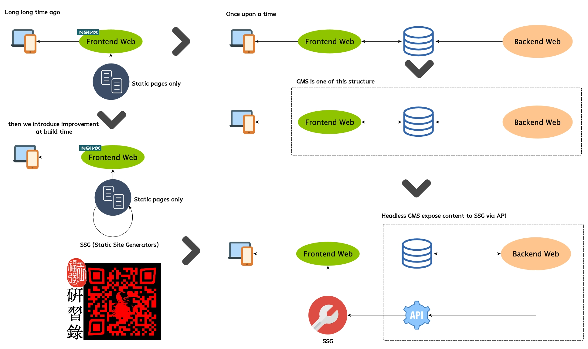

% SSG与CMS
% 王福强
% 2023-10-03

那天果总群里在讨论SSG ^[不了解什么是SSG的同学，可以移步[架构百科](https://jiagoubaike.com/)相关[专题](https://jiagoubaike.com/posts/Islands/)]话题的时候，看很多人好像分不清楚SSG与CMS之间的关系，所以就随手画张图...​

基本上的逻辑就是，从传统静态页面的网站（web1.0）时代走出两条路径：

1. 一条是引入数据库，增加动态性内容的管理；（web 2.0）
2. 一条是引入编译期间的转换和组合，但保留交付的静态特性；（web 1.5？）

原本一个web应用都会有个前台程序和后台程序， 中间用数据库维持共享状态。CMS作为动态内容管理的一类web应用，也是这样的结构，只不过实现细节上增加了版本化、CDN加速、发布部署等一系列周边和运行时基础设施。

今天，这种场景基本上被云上的Block-based内容管理方案给升级换代了，比如Notion/飞书文档等。 但底层逻辑其实没变，还是运行期的前台+数据库+后台程序的结构。

不过，生态是多样性的，将传统的静态化方案跟CMS方案结合（杂交不好听，hybrid比较高级些），也形成了一个新的生态样貌，即SSG + headless CMS的方案。 用户编辑内容和贡献内容还在CMS里干，只不过，如果对CMS默认的前端不爽或者想要用其它方案另作定制，那么，可以通过headless CMS提供的API拉取CMS中的内容，然后再在自己的SSG方案或者SSR方案里使用。

这就是上图的简单解读。

