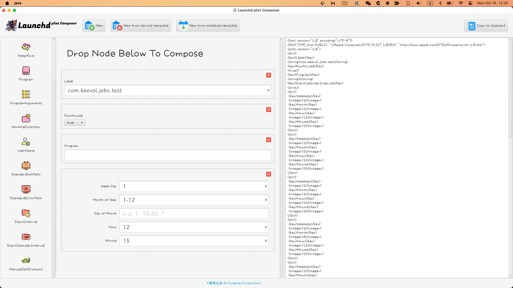

% Launchd plist composer released today
% 王福强
% 2023-10-16

Hey, guys

[Launchd plist Composer](https://wfq.gumroad.com/l/launchdpc) 1.0 is released, check it out, it's free. Grab it while it's hot ;)

<https://wfq.gumroad.com/l/launchdpc>

It's build with #JavaFX and #Scala, aimed to scenarios where composing plist xml content manually for #Macos services is trivial. Hope it helps and enjoy the tool.

It's also released [^1] at github: <https://github.com/fujohnwang/launchctl-generator/releases/tag/v1.0.0> 

[^1]: 昨天有同学反馈404，其实是github返回的status code不对，应该是401，因为这初始化成了private repo，现在转成[public](https://github.com/fujohnwang/launchctl-generator)的了(<https://github.com/fujohnwang/launchctl-generator>)，欢迎code review ；）

If you would like to watch a video introduction, here it is: [Introduction to Launchd plist Composer](https://youtu.be/gfRS-es2UH4) on [my youtube channel](https://www.youtube.com/@afoo).

写这个工具的初衷是有很多MacOS的后台服务或者调度服务需要写配置文件，尤其是调度规则的编写，[Launchd](https://jiagoubaike.com/posts/launchd/)的plist配置文件没法像crontab那样写个简单的表达式，手工编写xml又比较繁琐，所以，就有了这个工具的编写动力。

虽然最初是为了方便起草[Launchd](https://jiagoubaike.com/posts/launchd/)的plist配置文件，但原则上所有的plist文件都可以在[Launchd plist Composer](https://wfq.gumroad.com/l/launchdpc)工具中起草，只要拖拽（drag and drop）自定义内容的node就可以了。哦，对了，说到自定义node，提一下这个工具的设计思路，主要是沿用现在各类基于块（block-based或者node-based）编辑器的设计思路，只不过，plist的dict类型其实是没有顺序的，所以不用像很多类似编辑器那样处理分叉之类的逻辑，就是拖拽了什么节点，就生成什么节点的内容，就这么简单。

工具看着简单，但还是耗费了10+年前的P8好几天的精力，比较小众，所以免费放送给大家，有需要的自取。 

我们的口号是： **用古早软件 ^[使用了Intellij IDEA，Intellij IDEA是基于AWT/Swing编写的]和次古早技术 ^[当前工具使用JavaFX和Scala编写，JavaFX技术既老又在持续更新]打造极其小众 ^[操作系统品类下MacOS操作系统上细小场景下使用]的桌面软件**

