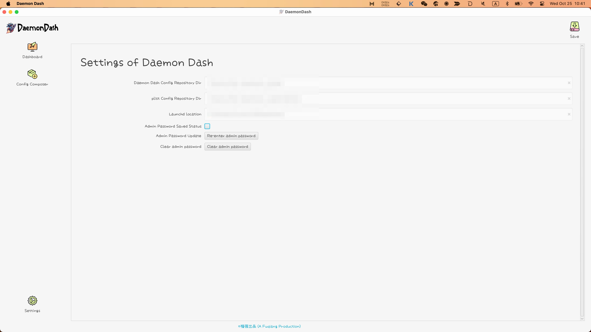
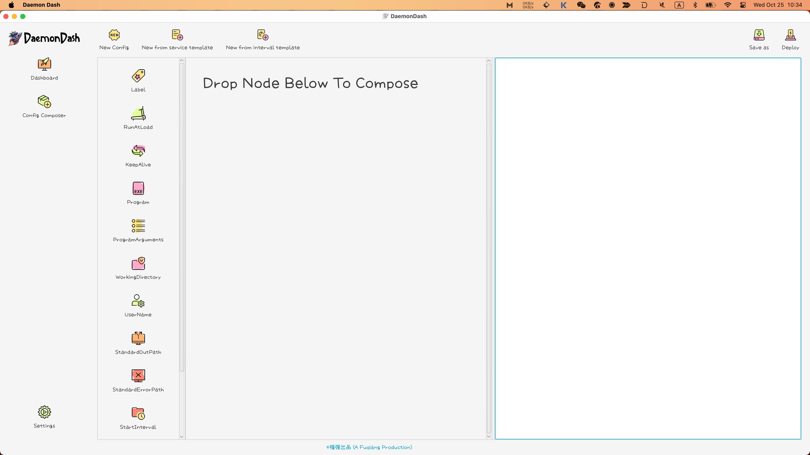
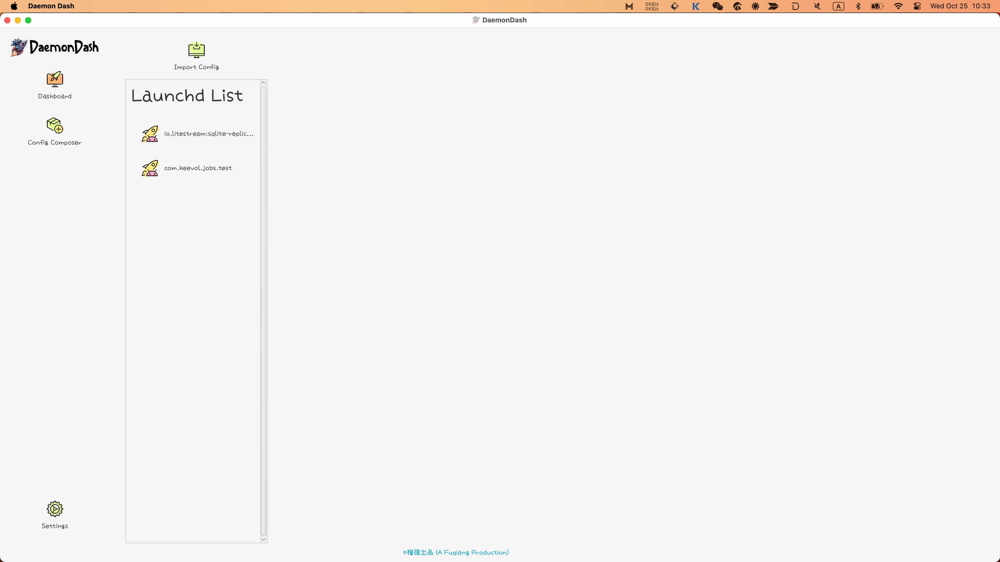

% Daemon Dash launched!
% 王福强
% 2023-10-25

[Daemon Dash](https://wfq.gumroad.com/l/daemondash) is a full-lifecycle GUI tool for managing launchd services, from config crafting to state management.

> BTW. If you want a free tool to craft launchd configuration, [Launchd plist composer](https://store.afoo.me/l/launchdpc) is a good choice(as I had mentioned it in previous post [Launchd plist composer released today](https://afoo.me/posts/2023-10-16-launchd-plist-composer-released.html)). Daemon Dash includes all features Launchd plist composer has.

# Features

1. launchd configuration editing with flow visually
    - save as / export (for other purpose / to other locations)
    - deploy directly via daemon dash

2. put existing launchd services under management in GUI
    - import by selecting via file chooser
    - drag and drop directly

3. full-lifecycle state management with each launchd service

4. admin privileges for once to ease management or ask privileges every time when it's needed

# Screenshots

You can take look at the following screenshots to get a sense what daemon dash does:

# Last but not least

It's a tool for small group of people, I think, but at least I'm one of them ;)

Grab it if you need such a tool to manage your own launchd services.

<https://wfq.gumroad.com/l/daemondash>

