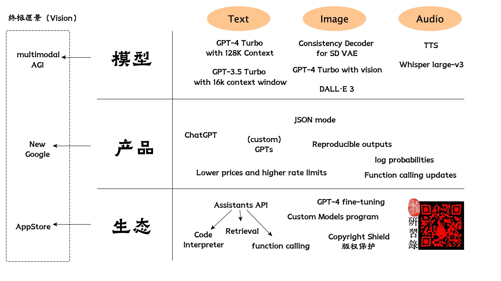

% OpenAI的野望
% 王福强
% 2023-11-07

OpenAI的DevDay开完了，本着终身学习的态度，背负终身学习的罪名：

特意画了这么张图：

除了对发布会的内容做个小结，也追加了个人的一些看法，比如，对大语言模型的结构化，比如， 对技术、产品与商业的结构化，比如，对OpenAI可能愿景与发展趋势的判断，等等。

有朋友在朋友圈看了说一眼就看明白了， 甚慰 ；）

也希望对各位看官有启发、有帮助。

