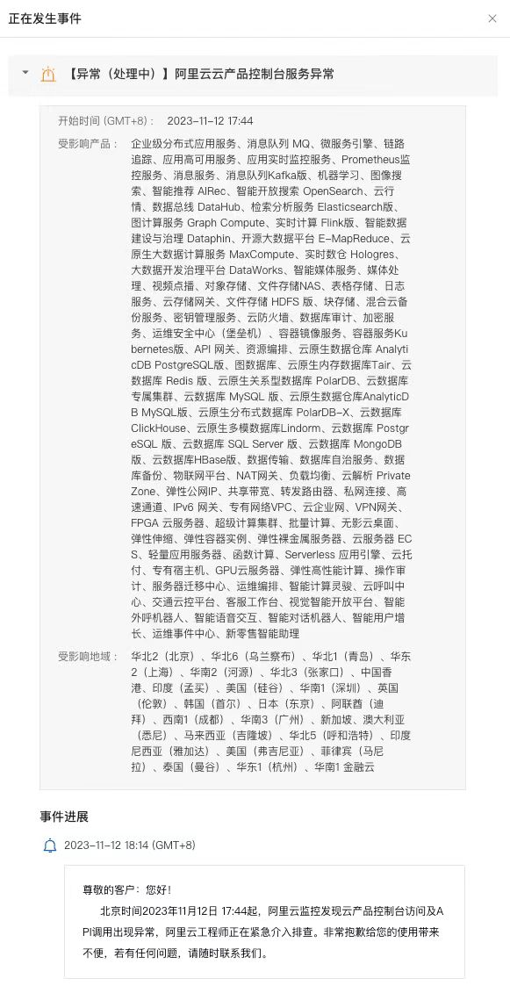

% 语雀又挂了，不过这次是因为阿里云...
% 王福强
% 2023-11-12


这次是阿里云全球大面积故障，所以，不单单是上次出故障的语雀受影响，淘宝、天猫、钉钉等也都受到了影响。 当然，这只是零星表象，从官方通报上看，基本上是全球大面积服务瘫痪：

```
受影响产品：企业级分布式应用服务、 消息队列MQ、微服务引擎、链路追踪、应用高可用服务、应用实时监控服务、Prometheus监控服务、消息服务、消息队列Kafka版、机器学习、图像搜索、智能推荐AlRec、智能开放搜索OpenSearch、云行情、数据总线DataHub、检索分析服务Elasticsearch版、 图计算服务Graph Compute、实时计算Flink版、智能数据建设与治理Dataphin、开源大数据平台E-MapReduce、云原生大数据计算服务MaxCompute、实时数仓Hologres.大数据开发治理平台DataWorks、智能媒体服务、媒体处理、视频点播、对象存储、文件存储NAS、表格存储、日志服务、云存储网关、文件存储HDFS版、块存储、混合云备份服务、密钥管理服务、云防火墙、数据库审计、加密服 务、运维安全中心(堡垒机)、 容器镜像服务、容器服务Ku bernetes版、API 网关、资源编排、云原生数据仓库Analyti cDB PostgreSQL版、图数据库、云原生内存数据库Tair、云 数据库Redis 版、云原生关系型数据库PolarDB、云数据库专属集群、云数据库MySQL版、云原生数据仓库AnalyticD B MySQL版、云原生分布式数据库PolarDB-X、云数据库 ClickHouse、云原生多模数据库L indorm、云数据库Postgr eSQL版、云数据库SQL Server 版、云数据库MongoDB版、云数据库HBase版、数据传输、数据库自治服务、数据库备份、物联网平台、NAT网关、负载均衡、云解析PrivateZone、弹性公网IP、共享带宽、转发路由器、私网连接、高速通道、IPv6网关、专有网络VPC、云企业网、VPN网关、FPGA云服务器、超级计算集群、批量计算、无影云桌面、弹性伸缩、弹性容器实例、弹性裸金属服务器、云服务器EC S、轻量应用服务器、函数计算、Serverless 应用引擎、云托付、专有宿主机、GPU云服务器、弹性高性能计算、操作审计、服务器迁移中心、运维编排、智能计算灵骏、云呼叫中心、交通云控平台、客服工作台、视觉智能开放平台、智能外呼机器人、智能语音交互、智能对话机器人、智能用户增长、运维事件中心、新零售智能助理。
```



作为一名技术“老中医”/老法师， 福强觉得关键故障点卡在了PaaS与IaaS中间的位置，或者说最底层通用Paas的某个关键服务上，起码这个服务要被上述公告中提到的受影响产品依赖， 当然，阿里云的公告中也提到这种可能性，只不过，它没有给出进一步的细节说明：


我们可以尝试逐步收缩一下范围，帮助阿里云做个诊断。

首先排除个别PaaS服务的问题，因为都收到了影响，相应的，上面的应用肯定受影响，所以，淘宝、天猫、钉钉、语雀等等，都会受到（间接）影响。

其次，肯定不是机房之类的故障，个别机房故障概率都很低，更不要说大面积机房故障。

那，现在粗粒度的故障区域就收缩到了PaaS与IaaS中间，因为现在都走Kubernetes加了一层资源调度（我之前叫它CaaS层）， 那，会不会是这一层出问题呢？ 直觉上很有可能，但看到个别产品的现象，这个可以排除，因为很多产品的页面只是局部错误，也就意味着起码VPS或者Applications不受影响。

在成哥的SRE群里，有人提到是AK的问题，因为我这些年对阿里云的产品没那么熟悉，而且它有经常改名，所以，提到缩写，我都得现查它是干嘛的，只不过，这回我是问了ChatGPT，给我的回复是Access Key服务，好吧，那差不多就是它了，因为它处在PaaS最底层，而且属于gateway性质的服务，它一旦出问题，那其他服务基本就访问impossible了，据说，几年前某P10就是因为这个服务出问题才背锅降级为P9的。

至此打住吧，反正，阿里云现在连CEO都没有，只能工程师们抓瞎了。

怀疑是不是因为双十一刚搞完，收缩容量，导致这个问题的呢？ 很有可能哟 😅

记得在[前面语雀那篇文章](https://afoo.me/posts/2023-10-23-why-yuque-crashed.html)里说过，随着预期和人性的双重加持，估计类似的故障会越来越多哦，让我一语成谶了？ sorry，瞧我这乌鸦嘴...

