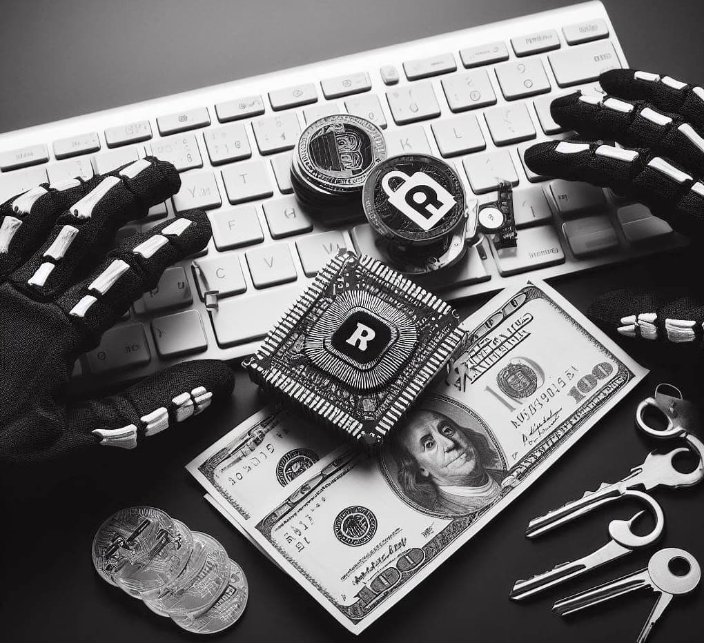

% 了解了下LockBit勒索工商银行美国子公司的事儿
% 王福强
% 2023-11-15

这个事情在工商银行（ICBC）运硬盘到美国的消息开始的，但当时没注意是咋回事，因为这种事情之前经常发生。后来，LockBit声称工商银行已经交了赎金，然后觉得这个事情有点儿意思了，所以就进一步了解了一下...

# LockBit是谁

LockBit是一个黑客组织或者叫赛博空间犯罪组织，说白了就是网络空间里的黑社会，当然，人家现在有个好听的名字叫RaaS（跟IaaS/PaaS/SaaS类似），全称叫Ransomware as a Service， “勒索即服务”，其实就是敲诈勒索。

LockBit的敲诈勒索有一套策略（嗯，人家在敲诈勒索领域也是专业的，而且可能算顶流），叫double extortion tactics，简单来说就是双管齐下， 不但加密受害者（组织）的数据，还威胁不交赎金就泄漏受害者（组织）的数据。

目前几个比较有名的案例是，像埃森哲、台积电、波音以及这个月的工行银行美国子公司。 当然，这些都是比较熟知的公司，其实LockBit在全球各大洲都有施行敲诈勒索，而且目标都是大型组织。

LockBit被人开始知晓是2019年，最早的勒索软件以`.abcd`作为后缀名标识被加密的文件和数据，2021年发布了LockBit2.0， 2022年发布了LockBit3.0，后缀名改成了`.lockbit`。

# LockBit勒索软件如何工作

LockBit采用了AES和RSA双重加解密机制 ^[AES是对称加密，RSA是非对称加密]，并且，为了提高效率，勒索软件只对每个文件前面几KB的数据进行加密（锁定）。

之后，LockBit的勒索软件会通过替换桌面壁纸（内含勒索信息），以及不定时通过打印机打印勒索文本的形式提醒客户交赎金。

这次有个软件因为LockBit勒索工商银行美国子公司的事情火了： [TOX](https://tox.chat/)， 这是一个开源的聊天软件，采用端到端加密，加上这个即时通信软件是因为斯诺登事件之后诞生的，LockBit能选择它作为消息投递和传输渠道，想必是比较安全。

# 如何应对类似LockBit这样的勒索软件？

网络犯罪其实始终存在，它只是现实的投射而已。

敲诈勒索软件也很常见，大多数时候，一旦中招，只能交赎金，毕竟，中国有句老话，“不怕贼偷，就怕贼惦记”，人家盯着你天天琢磨怎么“黑”你，加上这方面人家也更专业，更组织化运作，只有极小概率才有解救之法（比如有人恰好也知道勒索软件的漏洞，但毕竟还是极小概率），所以，最合理的预期和做法就是交赎金，以便让业务系统尽快恢复，然后再想办法亡羊补牢，以避免下回别再发生类似事件。

2019年某司的财务系统就是因为疏忽，被黑客软件锁定，我也只能建议CEO花钱免灾。 

说白了，这个跟IT团队人多少，以及是不是草台班子没关系，攻击和防护本身拼得就两个东西：

1. 成本与投入
2. 专业能力高低

假如你能提高攻击成本，那么，你受害的几率就低，否则就难免。

假如你（组织和团队）的专业能力更高，那也有解救之法。

假如都没有，那就闷声发财别招摇，但依然难免被工业化扫描到（对，干这行其实也早就工业化运作了，且是技术密集型产业），所以，矛与盾的较量，没有绝对的安全。

组织能做的，其实就是根据自己的发展解决制定组织和安全策略，到了什么阶段该配安全团队甚至与白帽子搞好关系，这些拼组织者的认知和觉悟，更拼组织实力，假如自己不懂，那起码得找个懂的人。话说回来，这也是为啥我经常提[LoD](https://store.afoo.me/l/lod)，**什么时候该找什么人、该做什么事儿，起码得心里有数**。

