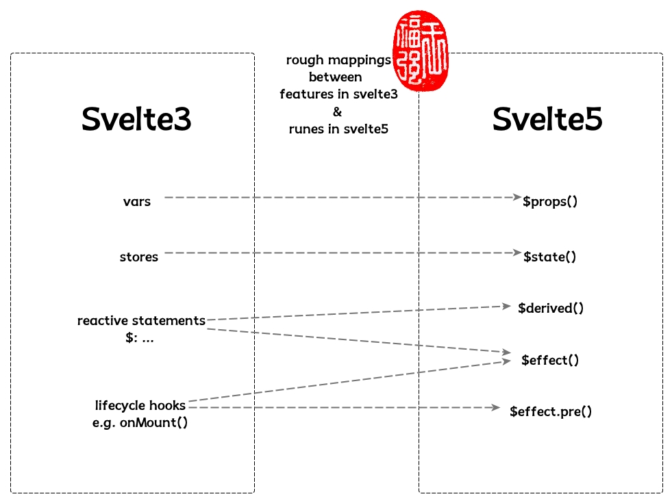

% Runes in Svelte5
% 王福强
% 2023-11-18

Hello, my friends

Today, I would like to share my thinking and understanding of runes in incoming svelte5.

At first, I "hate" such design, because when I chose svelte3 as my SPA web framework, I liked its instinct design which let HTML/JS/CSS do their own work. 

Let's say, as long as you know basic HTML/JS/CSS, you can get what the code does in svelte3(alghouth not exactly at some tricky features): 


```javascript
<script>
  export let firstName = '';
  export let lastName = '';

  $: fullName = `${firstName} ${lastName}`;
</script>
```

But after introducing runes in svelte5, code will becomes: 

```js
<script>
  let { firstName, lastName } = $props();

  let fullName = $derived(`${firstName} ${lastName}`);
</script>
```

It's also Javascript, but in another style. We have to figure out what `$props()` and `$derived()` exactly do before making sure it works.

It's not about good or bad, but about styles or tastes, I think. 

Even I (and other svelte3/4 people) don't like the change, but others may like it very much, so after a long time of diving into the docs and videos about runes, I figure out how they works and why they are designed in such way.

It's all about three things: 

1. states
2. events
3. functions

The three compose one thing: the reactivity.

Runes are reactive variables, so usually they are states we can listen to or add observers to them. Observables in RxJava or [Signal in SolidJS](https://www.solidjs.com/tutorial/introduction_signals) are all such things.

Svelte5 introduces 4 runes(reactive variables):

1. `$props()`
2. `$state()`
3. `$derived()`
4. `$effect()`

`$props()` is easy to understand, it's just used to declare properties of the component(.svelte).

`$state()` is similar to store in svelte3, but more general.

`$derived()` can reactive to any change of other `$props()` or `$state()`, in svelte3, we use  reactive statement to get such things done.(`$: ...`)

`$effect()` has part of functionalities of reactive statements:

```js
<script>
 let { width, height } = $props(); // instead of `export let`

 const area = $derived(width * height);

 $effect(() => {
  console.log(area);
 });
</script>
```

But it also take care of responsibility of `onMount()` lifecycle hook, furthermore, with `$effect.pre`, it also can intercept events between each frame update.

So that's all, If we draw a comparision, it maybe look like as following:



Hope it helps. If you don't know too much about svelte3 or would like to learn more about svelte3, [**Simple Svelte**](https://store.afoo.me/l/simple_svelte) may be a good start ;)


