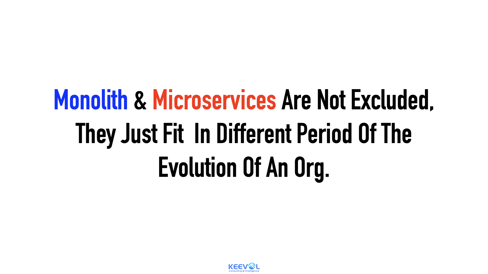

% 微服务无罪，有罪也是用的人理解不到位
% 王福强
% 2023-11-27

微服务你是上也好，缩也好，其实都没有问题，因为没有任何技术或者架构是普适的。

但你要上微服务，起码得理解到位，否则，那肯定被人诟病。

实际上，我们可以从技术角度、组织角度以及商业角度（或者说利益分配角度）来看待微服务与否的问题。



原则上，只有理解了周期，才能恰当的应用，这也就是为啥福强老师要提[「LoD」的概念](https://store.afoo.me/l/arch)。

# 技术角度

微服务其实就是SOA的延续，SOA工程实践的落地方式之一， 再往小了说，其实就是模块化的外延，仅此而已。

至于怎么搞好微服务，那就得看这家企业和团队的实力与见识了。

从技术选型到技术基础设施建设，都不能太差，否则上微服务就是自己找死，这我在[《微服务深度揭秘》](https://store.afoo.me/l/arch)里好多年前早就提过了。 至于说现在很多又下云啦，有微服务改单体啦，那是技术问题吗？不是，那是组织问题。


# 组织角度

微服务的落地实施依托组织结构的支撑，微服务的划分，本质上也跟组织结构的支撑能力相绑定，那么有那个金刚钻儿别揽那个瓷器活儿， 小破公司搞什么微服务啊，业务不增长甚至还停滞下降，搞鸡毛微服务啊，想不清楚这些，搞微服务不就是找死吗？

# 商业（利益）角度

当然，很多乱像其实也不全都是认识不到位造成的，反而是认识很到位造成的，比如有人说：

```
技术或架构不断变化，系统不断重新开发，对乙方来说多了生意机会，对甲方的IT部门多了活干（尤其现在没活干可能会被裁员），最终还增加了GDP，挺好的事情，😄
```

所以，同样一个微服务的词儿，背后讨论的时候往往是各说各的，这其实也是很多套路最后不了了之的原因，因为概念的关注点就不一样，就好像同样说“弹性”，你到底是在说elasticity还是在说scalability？ 


