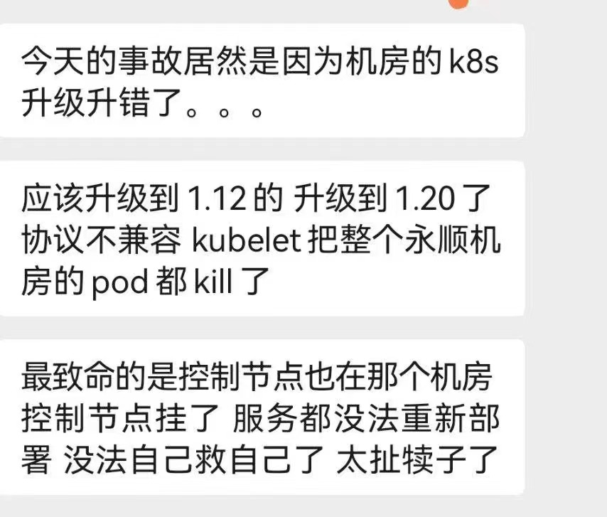
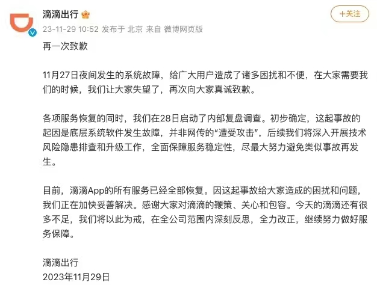

% 嘀嘀为啥也崩了这么长时间？
% 王福强
% 2023-11-29

没有深入了解，今年这种大瓜实在太多，吃不过来了， 从语雀到阿里云再到嘀嘀，这恢复时间都够长的啊，完全打破了我对互联网企业Ops应急响应时间单位的理解，从分钟直接干到小时级别以及天级别。

网传是因为K8S集群升级导致的， 不知真假:

但从官方发的声明以及故障现象来看，网传的图片倒是可能性很大：

K8S基本上就是大厂的系统级基础设施，它一出问题，那基本上就相当于汽车底盘断了。

SRE群里有老炮儿说，如果真是这个原因，那也太初级、太草台班子了吧？ 其实也还好啦，现实原本就很魔幻啊！毕竟，这个是分圈层的，相互之间很难理解也正常。

比如，我在[gumroad商店](https://store.afoo.me/)里的内容，很多同学穿越千山万水，最后要买的时候，却发现卡在没有信用卡上（或者嫌麻烦不愿绑定信用卡），这在有信用卡的人眼里肯定是很难以置信的。 

再比如， 2019年左右跟某团队里同学复盘故障过程的时候，问在场的同学，难道你们没有听过“不二原则”？ 然后一片沉默，嗯，真多就是不知道🤷

至于说老炮儿们通过类似的踩坑儿收获的经验和教训，年轻人肯定是不知道的，毕竟，你又没有把脑子里的东西通过马斯克的neurallink传输给他们，对吧？；） 谁都要一步一步通过踩坑儿犯错才能知道，至于这试错成本吧，员工就算罚款，赔得也弥补不了企业的损失。

**学费总是要交的**，差别只在于，是交在课堂上，还是交在现场。 

