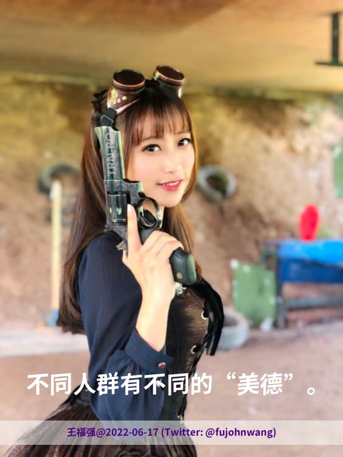

% 借东方甄选董宇辉小作文事件谈组织角色属性
% 王福强
% 2023-12-15

我无心吃瓜哈，也没有花时间和精力去从头到尾捋捋事情的缘由，我只尝试从**组织里的角色属性**这个角度来谈谈个人对这个事情的看法。

在一个组织里或者直接就说在一个企业里，我们可以拆出三种典型的角色属性：

1. 专业工作者（深度）
2. 组织管理者（广度）
3. 资产所有者（高度）

董宇辉再是超级个体或者说超级IP，他依然属于第一种角色，即专业工作者，只不过属于绩效极其优秀的那类。

东凡甄选现任CEO孙东旭属于典型的组织管理者角色， 俗称“职业经理人”，虽然他会有股权激励，但他不属于第三种角色，即资产所有者，也就是俗称的“股东”。

不管董宇辉跟孙东旭之间有什么矛盾或者情绪上的不对付，从组织利益的角度（也就是俞敏洪为代表的股东们），他们通常会站在CEO的一边，因为他们很清楚，整个业务盘子从零到一都是他们真金白银砸出来的，孙东旭负责运营和操盘，员工负责做事，而长时间试错之后，董宇辉莫名地在台上点燃了引爆点。 所以，就算董宇辉现在再红，那也是东方甄选这个平台给的，很多人离开平台才会意识到，有可能离开了某个平台，自己很难再支撑起这么大的摊子和影响力。

这是各自位置的角度，也就是俗称的“屁股决定脑袋”，屁股在哪儿，决定了如何思考和决策。

董宇辉是专业工作者的象征，到了那个位置，有可能会处于狂妄状态，虽然东方甄选或者说董宇辉的粉色们不觉得。没有做过管理者的专业人士其实很容易跟管理者起冲突，因为我老早之前也说过“**不同圈层有不同的美德**”，专业工作者崇尚的东西跟组织管理者崇尚的东西完全不一样，这也是很多企业里会发生这样事情的原因。 东方甄选这次的小作文事件不是个例，也不会是最后一例，更有千万个这样的事例可能正在发生。

你说一定是孙东旭嫉贤妒能嘛？ 不一定，管理者一般不会跟你比专业，更不会跟你比谁名声更大。 就算真的是嫉贤妒能，我甚至可以心怀叵测地把这个祸水东引给俞敏洪，哈哈哈，但这肯定多少有些过了，虽然也不排除有可能性。 ；）

最后，我们还是说说这个事情的潜在动向吧。

我觉得董宇辉很可能会被排挤走， 之后要么被挖，要么自己创业？ 

至于东方甄选，可能业绩短期会受影响，但死掉应该不会，因为业务模式和组织运作基本验证并成型，这其实也正是组织的价值。我在[《组织逻辑》](https://wfq.gumroad.com/l/cogg)里提到过，组织要的其实就是“标准化”，**轻个体、重集体**， 从这个角度来说，其实任何组织都是由“熊逼”组成的，这是组织的属性决定的，话可能听着难听，但却是实情，要不很多人天天“草台班子”挂嘴上呢；） 

但同样的事情，还是马云老师或者阿里巴巴会说话，“**一群平凡的人做一件不平凡的事情**”！

