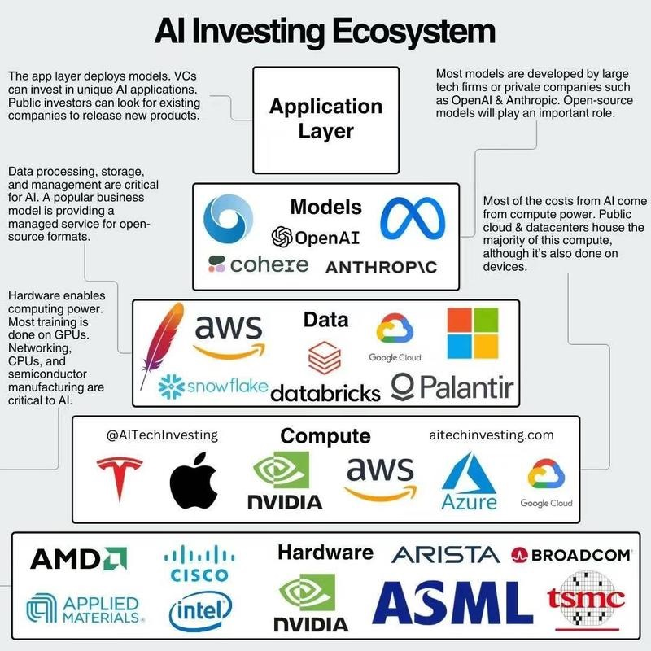

% AGI元年小结
% 王福强
% 2023-12-17

说2023年是AGI ^[Artificial General Intelligence] 元年，应该没有多少人会反对吧？ 眼看也到年底了，虽然今年的AGI发展是以周甚至日的频度来刷新的，但依然有一些可以抓得住的规律可以供大家参考，[个人一家之言](http://ai.afoo.me/)，欢迎拍砖。

像产业结构之类的big picture或者buzzwords我就不提了，网上很多，也不难获得，甚至也可以去[「为AI疯狂」星球](https://t.zsxq.com/0dI3ZA0sL)(https://t.zsxq.com/0dI3ZA0sL)看看，里面都有收录，比如这种：

或者这种：

以及原创的这种：

我重点说说个人对AGI的可能发展方向的看法，以及它无法替代或者无法突破的限制有哪些。

# AI/AGI可能发展方向

首先，传统的AI项目在AGI技术的加持下在持续强化，像OCR图像识别、TTS文字转语音、ASR语音识别等技术，都在以肉眼可见的速度改善。

其次，生成式AI（Generative AI） ^[注意区分AGI和GAI哟，AGI里的G是General（通用），GAI里的G是Generative（生成的）]是这波AGI浪潮的突出特点，不管是从文字生成文字（也就是大语言模型LLMs ^[Large Language Models]，或者经常简化成大模型，都是这个领域），还是从文字生成图像（比如Midjourney/StableDiffusion/DallE等），甚至从文字生成音频/视频等。

还有就是，基于现有AGI技术的融合，形成多模态的人工智能（Multi-modal AGI），让AI技术配合产品设计为人提供更佳人性化的体验，强化了语音交互的场景，从听觉、视觉等多个维度丰富了人与技术之间的交互接口。虽然离人与人之间的自然交互还有差距，但起码看到了《霹雳游侠》中类似场景的曙光。

模型小型化、微型化、轻量化也是一个趋势，我们可以看到业界逐渐出现了像微软的Phi-2、苹果的MLX以及ggml等模型以及模型格式和开发框架，更有很多人和企业已经将小模型放到了移动设备中去，相信会像原来的云到端的发展趋势那样，小模型会越变越小，也会越变越强。

RAG与行业知识库现在已经是很典型的技术和应用了，将来会不会有更不一样的发展，这个我们只能拭目以待了，起码，从数据到实践，中文环境里的大模型还是在垂直领域比较能打（下图来自沈欣总的PPT）：

再有就是大家很感兴趣的Agents，中文环境里一般叫智能体，如果说将来人工智能真的会发展出一套并行宇宙的话，那Agents可能是最有希望的载体和内核，毕竟，只要足够随机，谁又知道会演化出什么东西、甚至演化成什么样子呢？！

# AI/AGI无法替代人/无法突破的限制

很多人会担心丢工作，怎么说呢？ 该丢终究会丢的，工作岗位职能这些东西，其实是轮转的，可以类比股市里经常提到的那句“板块轮动”，从大盘子上来说，这东西是流动的，有衰减就有增加，要抱着一个工作干一辈子，不是说不可以，只怕到时候需求没了，那这个工作的意义也就没了，除非是个人兴趣，但个人兴趣是消费，不是生产劳动。

所以，可能不是AGI和人工智能让我们没工作，更多可能是我们自己没有跟上变化。好在，跟不上也没关系，因为人工智能和我们作为人有不同的优势和劣势，我们只要用好自己的优势就好了，配合人工智能的优势，就是最佳组合。

首先我们要知道，目前的人工智能依然是基于统计的逻辑构建的，所以，它的基础是数据。那数据从哪儿来？ 我们人类之前搞出来、放到计算机系统中（也就是**信息化**那个阶段）、进行清洗和计算（天天喊**数字化**差不多就这个阶段），然后才能交给人工智能去“炼丹”，也就是训练模型。 所以，它是在旧有的数据和人类知识上做“生成”，它虽然可以通过调整温度参数（temporature）来增大随机性，但整体上来说， 它的生成依然是在人类原有数据和知识上做“**组合**”，只要你我利用好它，那我们依然是跑在AI前面。

其次，虽然说AI是在人类已有数据和知识上搞“生成”，但并非那么确切，它其实是在人类已有数据和知识的局部在搞“生成”。人类的内心世界秘密隐藏的那一部分，它是没有训练数据的。 公开数据是它的基底，但这部分数据占人类知识的比例，往好了说是一半儿。 可能通过统计也能挖掘出这部分内容，但暂时看应该还没有，将来马斯克的某个公司真的打开了潘多拉盒子，或许会有进展吧！

最后，人只要不是去做那些**探索、创新**以及需要抽象思维之类的事情，单纯出卖劳力（不管是体力还是脑力），那确实很容易丢工作被取代，因为这东西很容易被AI沉淀下来重复做，而且还做得比你更标准、成本更低。

我们要做AI干不了的事情，比如：

# 小结

今年既看到了AI的狂热，也看到了AI的冷思考和实践案例，总的来说，2023年AGI的发展确实是让我们振奋的领域之一。

只不过，我们还是得“拉车”+“看路”兼顾， 还是搬出我在2008年出版的[《Spring揭秘》](https://afoo.me/books.html)(https://afoo.me/books.html)里提到的**Donald J. Trump**(也就是“特朗普”)的那句话来送给大家：

⇒ **"Before the dream lifts you into the clouds, make sure look hard at the facts on the ground."**

[KEEp eVOlution](https://keevol.cn/), Keep running, 只要站在AGI的肩膀上持续跑在前面，我们就不需要担心和恐惧被AGI统治，该担心和恐惧的，其实是... 🤪

