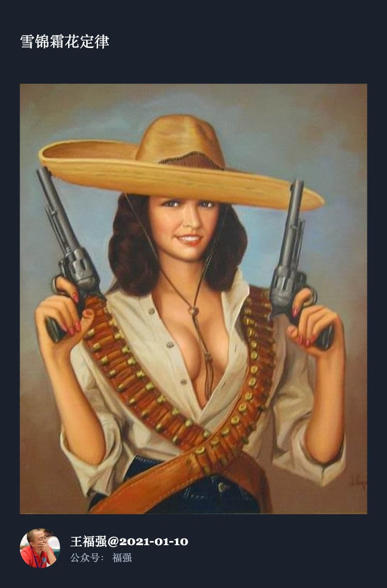

% 阿里巴巴无人可用了？
% 王福强
% 2023-12-20

今天发了个朋友圈：

有朋友问我，这是我对阿里CEO不太待见？ OMG，我哪儿配评价人家啊， 这条朋友圈纯粹是根据**组织信号**有感而发...

通常来说，这么大盘子的CEO不应该兼任多个单元的CEO，但阿里最新的组织结构调整却又这么干了，这背后说明好几个问题：

1. 大战之前，CEO御驾亲征
2. 大战之前，不敢启用猛将
3. 大战之前，无猛将可用

结合现在市场上的业务布局与人才流动的动向，基本上可以断定，3的可能性比较大，进而只能1和2成为现实。

还有就是现任CEO虽然是技术出身，可能有撸袖子“让我来”的天性，但毕竟从事管理和合伙人这么些年，管理与战略肯定更胜一筹，技术造就不是考虑的核心因素了，所以，最理想的决策肯定是他做中军帐，任何一个主攻方向指定合适的猛将去拼杀就好了，现在要自己既盯战略还盯战术，还身兼数职，显然也是无人可用的概率更大一些。

想当年马老师的时代，那可是猛将如云啊， 有趋势在，有持续的正向激励，加上强大的组织能力，从来就不会担心没人才用，但时移势易，三十年河东三十年河西，在平台期与下行期的压力下，聪明人早早就跑字节和拼夕夕了，剩下的忠良和“地方大员”优势都在守住一块儿， 但你说能从0到1甚至全局控盘的人，从阿里的选拔机制与成长历程来看，确实不好找，最好的选择就是从外部并购或者收购进来的一些创始人，比如你们都知道的J凡。

可惜啊，好像谁都逃不过周期 ^[还记得我之前提到的LoD吗？ Lifecycle不就是周期吗？ https://wfq.gumroad.com/]，主要是哪个阶段都是各种因素叠加，能力挽狂澜的人，也需要一些运气，祝好吧～

