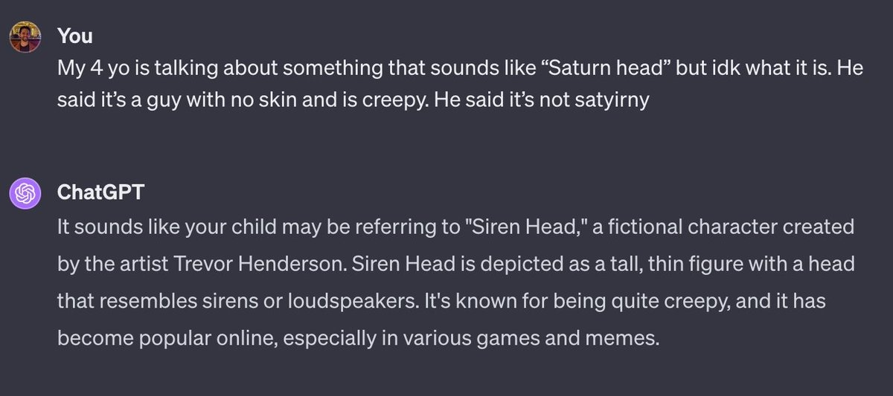

% ChatGPT如何改变了你我的日常生活？
% 王福强
% 2024-01-04

OpenAI的联合创始人/Co-founder 发了条推，问大家ChatGPT给大家生活带来了什么改变（How has ChatGPT changed your life?），有几个人的案例挺有意思，当然，这是相对于那些常见的可以帮助你写代码、写文字、生成插图等任务性工作而言。

# 盲人的超智能伙伴
有一位是盲人，ChatGPT的app有语音交互，直接可以把原来只能靠看（文字）才能交互的信息跟他连接上了，相当于直接有了一位超智能伙伴；

# 跨代沟通无障碍
有个当爹的听不清他家4岁小崽儿到底在说啥（口音不清），然后也模糊的问ChatGPT，ChatGPT居然给了他合理的解释：

# 联合创始人/Co-founder

有超级个体或者说个人企业家/solopreneur（国内估计更习惯叫个体户）说给自己找到了一个联合创始人，那就是ChatGPT ；）

类似的观点：

> As a small business owner, it's helped me save time on writing contracts, leases and business communications. Hasn't changed my life but if I had it when I was starting out - definitely.

> 就好像在电脑里招了100个实习生和助手。

> My two person team are able to build our product with the same speed it probably would have taken at least 5 people before. // 两个人干了五个人的活儿

# 水管工
有人说他家厨房的厨余处理器不转了，搞不清楚咋回事，就拍了张照片问ChatGPT，ChatGPT给了他相应的反馈，搞定。

# 失业再就业
> I lost my job because of an AI related lay-off and then pivoted to a consultancy offering chatgpt-powered misinformation/election rigging campaigns.

因为AI被裁员，但转而做了顾问，还是专门针对ChatGPT的，因为需要有人判断信息的有效性和真实性。

# 说在最后/last but not least

Redis 作者[写了篇文章](http://antirez.com/news/140)，分享用 LLM 编程的体验，他提到 LLM 能极大缩短学习新技术的时间，非常适合写一些“用后即丢”的代码，但在个人本身已是专家的领域中帮助就小多了。

这与我个人的体验是类似的，对于专业工作者来说，我觉得面对ChatGPT有一个准则：

**如果你是专家， LLM就是你的助手；如果你是小白， LLM可以是你入门的老师；**

但不过是哪种，都要学习和熟悉如何向ChatGPT**提出好问题**。

