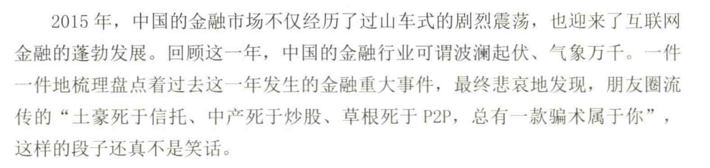

% “劝”是最出力不讨好儿的事情
% 王福强
% 2024-01-22

摘自[《坑获2》](https://wfq.gumroad.com/l/kenghuo2)

---

鼎益丰这个事情的本质其实不是骗子有多拙劣，而是大家更多要思考为什么那么多人参与，更要思考操盘的人是谁，是浮在水面上的马小秋和隋广义吗？

其实 **“劝”是最出力不讨好儿的事情**。

任何一个骗局都像是一场共谋，只有最后的傻子陪着贡献本金。

年化利率如此之高，明眼人都知道有问题，但就是有人乐此不疲，宁愿抵押房产加杠杆的往里投，还不是为了利？ 人性里的东西是改不了的。

至于说很多人觉得这些人傻，其实，傻也只是一部分，更多还是**人为财死**。

从鼎益丰一方的角度，能把玄学+传销糅合在一起玩这场游戏，玄学和传销也只是手段和工具，如何操这么大的盘子，背后没有更多共谋的利益方我是不信的，不看看真的自己跳进水里做个小事情有多难？

很多短视频介绍各种成功商业模式的死穴在哪儿？**只谈收入，不谈投入**。

流量从哪儿来？ 营销和投放费用花了多少？多少投入才能换来生成的收入？ 收入和利润是一个东西吗？

这些都不谈，因为谈这些跟短视频流量是冲突的，要的就是情绪、不动脑子、发财梦。

所以，劝什么劝，猫有猫道，狗有狗道，各走各道。

**“劝”是最出力不讨好儿的事情**。

最后，猜猜这个内容来自哪本儿书？；）

其实“劝”这个行为不讨好，除了要对抗人性，还有一个关键的因素，就是，你劝的同时，其实是与某个利益方的利益在做对抗，俗话说：

**无利**反而**致害**，图啥？

