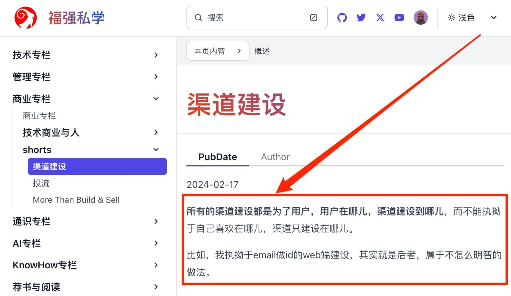

% 为什么「福强私学」用email作为注册账户的标识ID？
% 王福强
% 2024-03-04

虽然我知道人群老早就转移到了手机上，Mobile-first也喊了好多年，但用email做用户唯一标识id可以说是我的一个执念，虽然我也知道这个执念从商业或者产品角度来看，都不是那么理性。

手机号方便是方便用户了，但手机号跟用户主体之间并没有固定的唯一性关系，起码早年是如此，手机号随便换。
现在可能大家都意识到手机号成了很重要的“资产”，不经常换了，也算是现实巩固了手机号作为用户表示的地位吧。

我认为，作为用户标识ID的信息需要有至少两个重要属性：

1. 跟用户唯一绑定
2. 跟用户终身绑定

手机号都不能满足，但email相对来说更容易满足，只要邮件服务商不倒闭或者域名可以自己一直续。

使用email作为用户标识ID的最主要一个考量是，email账户本身就有很强的安全性，假如加上2FA（两阶段安全认证）都不能保证账号的安全，那么，任何一个基于email做账户标识的系统其实都无法保证。

所以，唯一、终身、安全，这就是「福强私学」选择email作为注册账号主体标识的原因。 很多流程也基于此进行的设计。虽然不利于传播和转化，但关系不大，原本就定位于一个小众的社区，用户的信息安全与隐私更该被重视。

