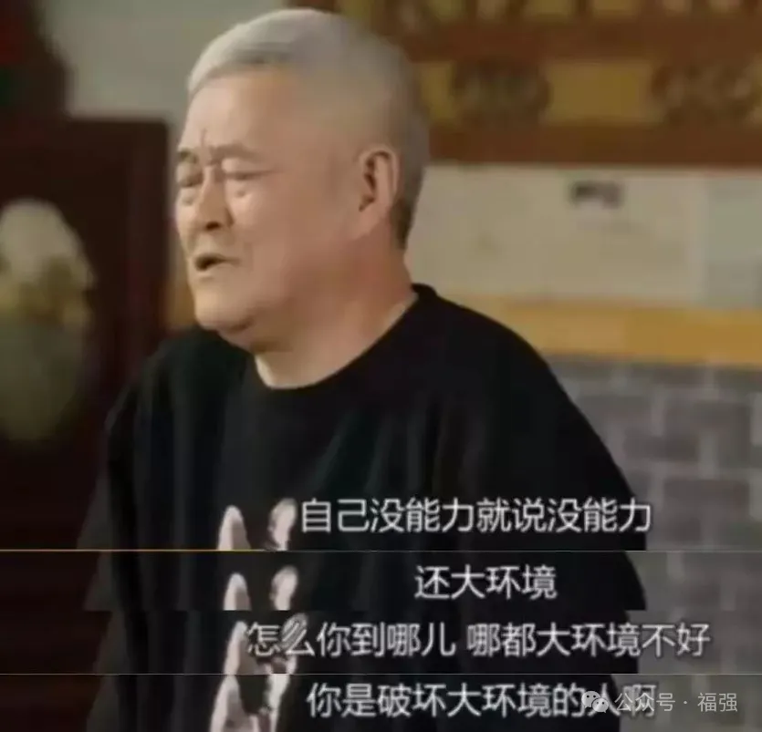

% ToC的爽或许不同，但ToB的痛却往往相似
% 王福强
% 2024-04-18

今天高中同学来村儿里接我去喝茶，从下午一直聊到晚上20点多，不仅有了标题上的感叹，“*ToC的爽或许不同，但ToB的痛却往往相似*”

比较巧合的是，今天在X.com上也碰到一位同学发了条消息如下：

> 好想听失败的独立开发者分享经历，毕竟成功经历多少都带点幸存者偏差。

遂在其下推荐了自己好多年前写的[《坑获》 (https://store.afoo.me/l/kenghuo)](https://store.afoo.me/l/kenghuo)，

而其中的很多内容，和我跟我同学半天里聊的很多东西都很契合，也难免有些“心有戚戚焉”的感觉。

比如，做商业要挣有钱人的钱。

比如，跟客户定价都是固定价格，而不讨价还价。

比如，不要把不合适的产品卖给不合适的客户。

比如，隐形成本与隐形收益；

比如，什么客户能做，什么客户不做；

比如，PLG与SLG；

比如，...

你会发现，tmd做ToB该踩的坑儿，好像你一个都避免不了。

当然，我今年开始更多精力是扑在[「福强私学」这个内容产品上(https://afoo.me/kb)](https://afoo.me/kb)，已经不怎么做ToB业务了，只有有缘分的客户才会承接，所以，这些踩坑儿的收获也就归档了，但不排除跟有体感的人聊这些东西依然会很嗨，因为这些东西只有真的做过、有切肤之痛了，才会真正的理解个中滋味。

**很多事情，只有自己做过才知道自己适合不适合。**

我做ToB不成功，不意味着其它ToB创业者也不成功，但肯定会有很多相同体感的同路人，真心祝愿ToB的创业者能成事儿，虽然大环境没有赵本山说的那么不重要。图片

GL & HF， ToB Entrepreneurs！

