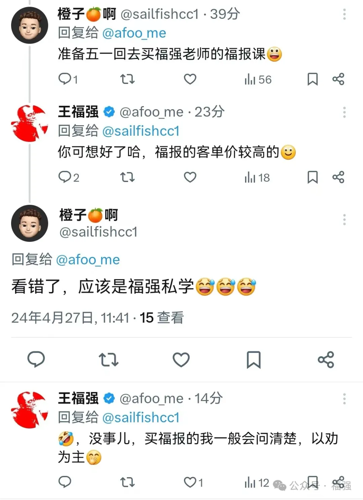

% 福强的内容产品与服务体系，看这一篇就够了！
% 王福强
% 2024-04-27

先看图：

感觉很多人应该也会有类似的疑惑，分不清楚福强提供的内容产品和服务里到底哪个是哪个。鉴于此，为了进一步澄清这种困惑，遂整理一篇完整的产品和服务介绍于此，希望对大家了解和选择福强提供的内容产品与服务有所帮助。

参考Value Ladder理论，经过长时间的筛减与标准化之后，[福强的内容产品与服务体系](https://edu.afoo.me)现状如下(https://edu.afoo.me)：

# 福强私学

产品形式： 文本知识库

「福强私学」是基础款内容产品，主要包含技术类、管理类以及少量商业通识类内容，最初的预期是服务做技术工作但又身兼领导与管理职责的同学，但后来发现也有不同行业的老板和自营业者参与了进来，这个是我没有想到的。

但总的来说，「福强私学」更多提供的是**做事的思维和方法论**，不牵扯利益纠葛。

# 福报

产品形式： 视频 + 文本

「福报」是进阶款内容产品，主要包含架构、组织管理（及案例）、商业股权甚至最新技术趋势等内容，牵扯到底层逻辑与利益纠葛，所以，预想的服务对象是资深架构师、CIO/CTO以及创业者（startups founders）。 选择购买「福报」的同学，我一般建议先找我单独聊一聊，不建议直接购买（产品介绍页上有联系方式）。这样做的原因是，第一位购买「福报」的同学第一年订阅结束后没有续订，单独了解情况后发现是他没有感受到这个产品里内容的价值，为了表示歉意，我也单独送了一份“分手”的小礼物。 那是不是说「福报」的内容真的没有价值呢？ 其实价值是相对的，产品只有遇到对的人才能产生最大的价值。因为人在不同阶段， 关注的东西不一样。

就像X上有个小伙子发了个插图：

姑且不论连续八年A+绩效的当事人收获了多少财务上的回报，单就这张合影来说，懂的人自然懂它的分量，但这位小伙儿显然是不懂的那类（没有贬低的意思，只是说个事实）。 试想下，任正非任总可以说“一杯咖啡吸收宇宙能量”，那是他请你，但假如你想跟任总喝杯咖啡，你觉得得先吸收多少“宇宙能量”？ 😉

结合后面续订的同学们的背景和经历，为了避免不合适的同学花高额的冤枉钱，所以才会决定先聊一聊，以“劝”为主，目前已劝回多人。

# 福强面对面

服务形式：线上/线下

「福强私学」和「福报」都是内容类产品，「福强面对面」则是服务。最早用的服务名“福强一对一”，但不排除后面会有线下活动，所以，现在的服务叫「福强面对面」。

提供这个服务的目的是这样的，内容产品需要自学， 周期长、反馈慢，这跟健身一样，虽然中长期来说是好事儿，但用户短期内感受不到价值，所以，「福强面对面」服务的目的就是为用户提供及时的支持，用户遇到问题和疑惑，想要马上获得支持，那么，就可以直接把咨询费砸过来，福强会尽心尽力为您服务 😁

收费觉得贵？ 其实换算下来并不贵，花个十二分之一甚至百分之一的试错成本，避免掉入大坑儿，没有比这更划算的了。

之前「福报集团」微信群有同学问了一个入职哪家公司的问题，某集团总经理给了一句话建议，我直接附和说这句话价值20+万，其实一点儿都不夸张或者往脸上贴金，没有这一句话，每月少一半儿工资，更不要说一年、两年整体算下来。你自己算算是不是赚大发了呢？

# 小结

福强的整个内容产品与服务体系建立在 **实战与原创** 的基础上，并没打算像传统知识付费那样以制造焦虑的方式进行销售，各位自己判断、自行选择，也可以找购买过的同学聊聊。

娱乐偏消费（及时满足），教育则类似于健身（延迟满足），并非互相排斥，只愿你想要了解一些不一样的内容的时候，可以想到福强的这套内容产品与服务 😘

[X/Twitter: `@afoo_me`](https://x.com/afoo_me)

