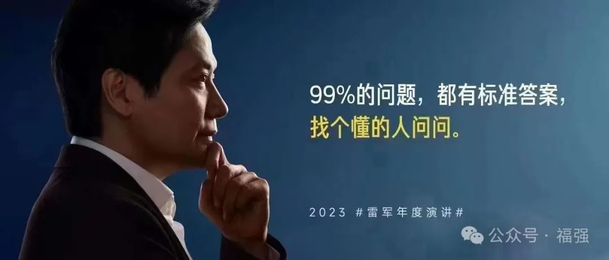

% 已经没有低垂的果实了...
% 王福强
% 2024-05-01

今天微信上有位同学私信我想要跟我干，首先谢谢这位兄弟， 但臣妾做不到啊， 我一人公司到这个月5.12日就是7年了，假如我真的有扩张的想法，可能早就不做一人公司了…

现实是，我整整趴了七年，往好了说叫爬了七年😂

抛开个人和公司情结不论(其实是格局不高😂)，假如这位兄弟看过[「福报」](https://fb.afoo.me/)里的第一课「底层逻辑」（我不是卖课哈，只是说个事实），应该也不会冒昧地开口。 合伙人是很难寻的，况且我对这位兄弟并不了解（我也不记得什么时候加的微信，听起来也不在一个城市），在一个VC泡沫破灭的时代，低垂的果实已经没有了，这个时候雷军早年说的那句话我觉得挺合适，他作为投资人，也只会投给他熟悉的人或者朋友...

靠几张BP或者动动嘴皮子就能拿融资的时代早就结束了…

人哪，自己的路终归还是得自己走，别人充其量给个建议和参考，因为每个人的status不一样（正在看的书里用了这个词儿）。

安全垫厚的时候可以路上慢慢寻找合伙人，安全垫不太厚的时候，从一开始就是比较熟悉或者合得来的人一起做事，风险才更可控。但不管什么时候，合伙人都不是随便撮合的角色。

当然，我也只是随便扯几句， 毕竟，每个人还是得撞过南墙才懂，就像[《坑获》](https://store.afoo.me/l/kenghuo)里写的那样，也只有做过、有过了体感，才会心有戚戚焉一样。

虽然古人早就告诫我们要“君子守时”， 但现实的发展却往往千差万别，赶上寸劲儿了，就是错过了或者没赶上，那也得接受现实，整理下自己，重新出发。

能在职场找个工作挺好的，起码不会被人骂“渣男”，😉 （这个梗儿是因为X上有位孔雀性格的独立创业者，说自己被人骂）

创业不是九死一生，而是九十九死一生(甚至无生)，最后承担最终后果的都是股东，所以，股东不会在风险系数高起的时代随便引入更多不确定因素。

努力找个工作吧，兄弟，起码这还是要比创业要轻松多了。

*本来想开玩笑说给他开个高佣金让他帮忙带货[「福强私学」](https://edu.afoo.me/)，但还是打住了，毕竟，自己也从来没有想大规模搞分销，虽然做了相关功能，但从来没有准备好大规模推广过。*

