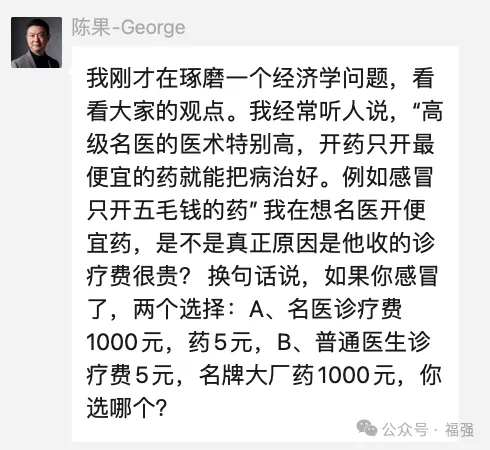

% 看病的与卖药的，到底谁更重要？
% 王福强
% 2024-05-05

果总在群里问了一个问题：

谈谈个人看法。

其实我觉得这个假设是不成立的，之前我做咨询的时候，其实也会有这样的臆想，但客户可不是这么想的，既然是做生意，那么肯定以客户和市场为导向。

单纯的商业模型是很容易理解的，比如非标高客单价VS标准低客单价，但实际的市场远非模型这么简单，还要掺入更多人性与利益。

其实，把医疗跟商业相提并论是直觉上合理，但实际上并不合理的事情，就像之前有的公司老板跟我开玩笑说让我这个“技术老中医”帮忙看看团队和产品技术，但实际上，商业就是商业，医疗和商业相提并论，就是把短效与长效混为一谈。

作为病人，肯定希望短效，有好药，吃完病马上好，这是病人的诉求，但换过来，假如你是医生端，如果按照传统中医的优良美德，那肯定你也跟病人同疾苦，一副药搞定。但假如你要通过你的医术挣口粮，你还会医德高尚吗？我相信很多医生都是医德高尚的，但医疗商业化之后，双方利益是不是有些冲突？为什么有句话叫“好药可不是好商品啊”？

换到咨询市场也是类似的尴尬，你咨询完了，方案出了，整个商业活动就终结了，后面的交付和维护才是大头儿，但这些长效的商业活动已经跟你无关了。你甘心吗？😉

在国内市场，咨询没法主动形成有效复购，只能通过打新形成增量，所以，很多咨询公司，尤其是IT咨询公司才会通过咨询加产品或者项目的形式绑定用户，一定程度上算是某种复购。 同样，这样一体化的组织形式也把短效的商业活动变成了长效的商业活动。

商业的是长效，投机和侥幸才要短效。

很多时候我们觉得独立、无利益相关才是对客户好，但实际上，客户，尤其是ToB客户要的不是这些，toB客户要的更多是：

1. 一个接口方给我全部搞定，自己整合，开什么玩笑，累死我啊， 别给我找事儿、找麻烦

2. 出了事儿你得给我背锅，没实力背锅？那滚犊子

3. 便宜点儿、再便宜点儿、再便宜点儿...
