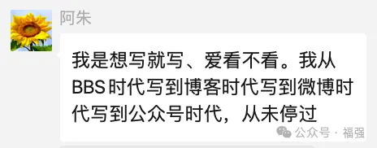

% 写作这东西...
% 王福强
% 2024-05-08

出发点不一样，内容的输出效果自然也就不一样。

有人抱怨中国传统古籍都是“糟粕”： 

> 孙子兵法，浅显易懂，我读过不止一遍。比如兵者，诡道也，但究竟怎样以奇正骗过敌人，并没有讲述。都是些正确的不可执行的废话。用一章论述间谍，除了多花钱外，并不知道具体怎么办。

我觉得这是对不同的书籍和文字输出的诉求有**不合理的预期**。

说句不好听的，像孙子兵法这种，作者并不像今天自媒体似的要自己恰饭钱（把你写爽了，有钱赚），反而有点儿阿朱的意思：

说白了，我不图你钱，对你也没啥责任，写出来了，无非是自己的心得体会，你走到那一步却还看不清的时候，这些内容可以帮你佐证下你走的对不对，除此之外，确实没有啥指导和教练，它不是工具书或者作业手册，它只是作者走到**后半程**的时候自己写了个个人总结，至于看不懂，或许只是你要么没走上他走过的那条路，要么就是走得还只是**前半程**。

俗话说，**为学日益，为道日损**， 大部分你看不懂的，应该都是“道”， 你要悟道，可能得**多学多看多干**，否则看不懂很正常。毕竟，书也只是面镜子，看懂看不懂，照射的都是你自己。

