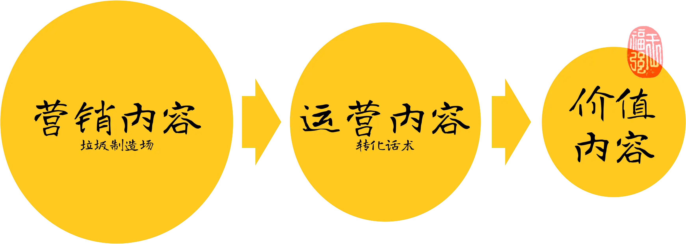

% 3种不可不知的中文语料
% 王福强
% 2024-05-23

说中文语料彻底沦陷肯定是危言耸听了，只能说垃圾中文语料众多，因为原本互联网上的内容也是分等级的：

营销类内容大多都是垃圾内容，因为它的目的只是为了吸引你的注意力，只要打成这个目的，那就成功完成了此阶段的KPI， 所以可以无所不用其极，只要让你爽、让你颠、让你“喜欢”就行，什么标题党啦，什么黄金五秒啦，什么免费啦，都是服务于此目的。

运营类或者说销售类内容次一级，它服务于转化的目的，内容总不能太垃圾，否则，打不成目的啊，对吧？

只有价值类内容才是核心和关键，虽然有些人会觉得有的内容也是水货，这也没有办法，因为没人能保证一个人群里总都是好的，马老师不是都说了嘛，七个人里有人杰，百个人里有人渣，总有例外。 但大面上来说，价值类内容对与目标人群来说都是有价值的。

那是不是只要价值类内容就一定是付费内容呢？ 也不一定。这个也由内容提供商的商业模式决定。

像《财新》这种价值类内容，是通过直接付费的商业模式来形成价值交换的。

而很多内容其实是通过拉长链条错位竞争，比如从广告商拿广告费，从营销内容拿流量，中间商赚差价， 价值被分化了，各取所需，这个时候的内容可能就只服务一个目的或者说一个KPI，流量。你说这类内容是不是价值内容，我也不好说，你们觉得呢？

其实大家都在骂某度是垃圾制造厂，但其实，某度还是有一个内容产品我决定挺好的，就是我有些时候要对中文单字进行溯源和研究的时候，某度的某个百科产品还行，其它的我确实也不咋用，垃圾不垃圾不好评价😉

所以，中文语料真的沦陷了吗？maybe not！

