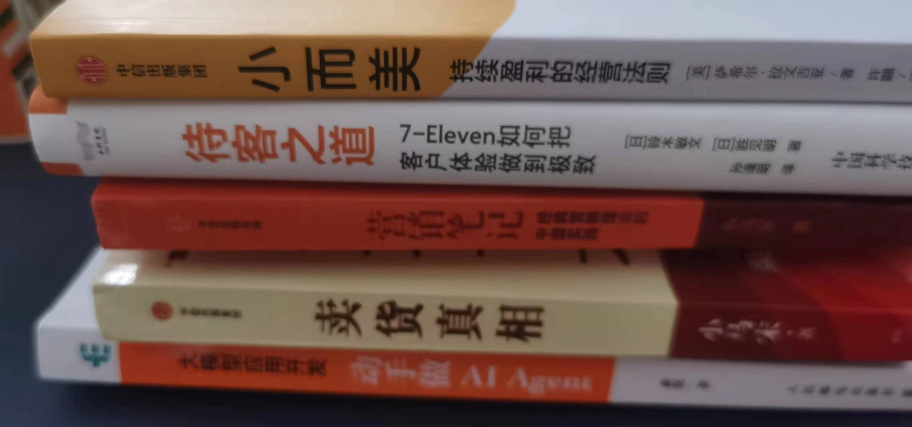
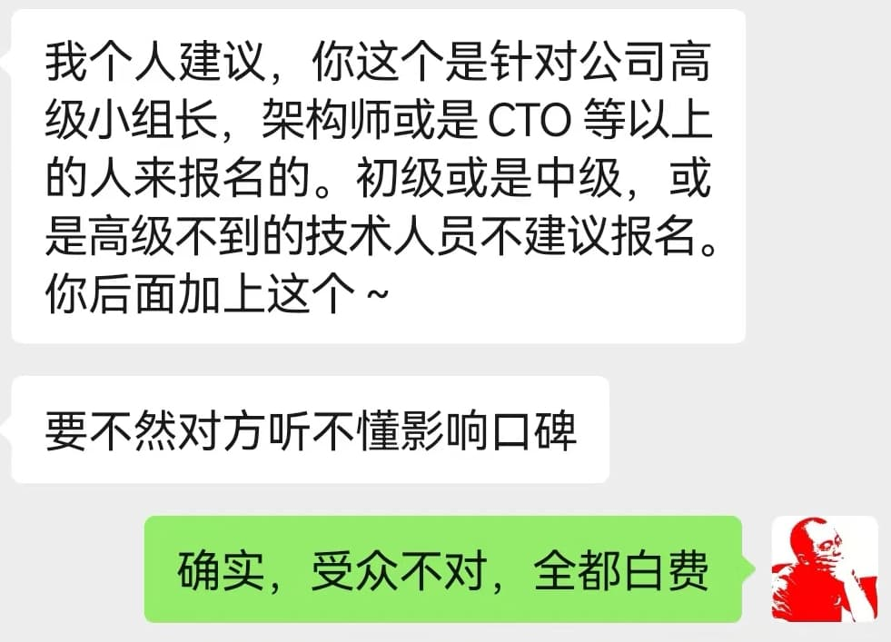

% 低端用户理解不了高端价值！
% 王福强
% 2024-07-15

今天晒了个书单：

有同学回复说是地摊儿文学。（应该是指这本儿《小而美》？）

我有些疑惑，到底是我有认知偏差，还是对方有什么高见，就又跟进多问了几句，问得策略和标准是：

1. 这么说之前，是否已经读过这些书？
2. 下这个结论的出发点是什么？

显然，1的答案是No，那2的答复基本也是演绎跟AI幻觉。

Anyway，起码我知道自己没有认知偏差了。

我知道上面的标题可能会有人很不忿，可是，假如一个人达不到某个层次或者接触不到或者从来都没有关注某些东西，那么，这些东西对他来说就是“虚”的，没有价值感的。

我是从「福报」的第一位用户那里获得的这个认知，不是「福报」的内容不好，也不是他不好，而是双方不合适。假如不光他说不好，而是所有订阅者都说不好，那肯定是「福报」这个产品不好，但现实数据不是这样。所以，后面我对要订阅「福报」的同学有个前置沟通的环节，目的就是避免类似的情况再次发生。

无独有偶，上次跟一CEO聊线下交付的产品和服务，他在我没有问询的情况下也表达了类似的观点：

进一步说，当年湖畔大学招生其实也是类似的道理，就算你能出得起那60万还是多少的学费，不符合整体上其它标准，依然不会让你入学的。

总之，就是两个字： **筛选**。

客户筛选产品和服务，产品和服务提供方筛选客户，这是一个双向的过程，核心目的就是**价值匹配**，没有谁瞧不起谁的意思，只是看双方是否**合适**，合适了才有进入下一步的可能。

