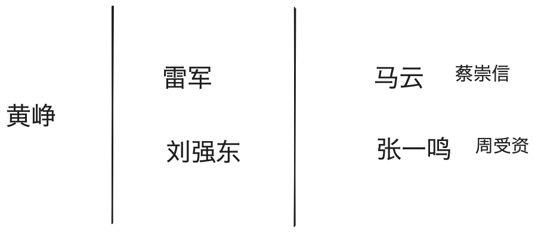

% 雷军与周受资的爱恨情仇
% 王福强
% 2024-07-20

刷到小米雷军谈周受资离职的短视频，才知道他们俩之间居然还有交集。

其实，研究下他俩的属性，可以推而广之，看到两类很典型的企业和人群。

雷军和刘强东代表的是本土企业家，他们吃苦耐劳，兢兢业业，踏实苦干；

马云和张一鸣代表的是相信并践行西方价值的本土企业家，他们有智慧，有远见，敢授权；

这两种截然不同的属性有点儿当年NASA的那个领导人跟特雷萨修女之间的价值观与世界观差异，不能说谁高谁低，谁对谁错，只能说真的不一样。

相应的，如果双方在这些价值观与世界观上有差异，往往就很难一起走的长久。

吃苦耐劳的企业家往往重感情，讲义气，所以，对于人才，既爱又恨，在他们眼里，离职就是背叛，有个上过百家讲坛的老师讲这种情况叫“满意的叛徒”，比如关羽对曹操，但我觉得这更多是小说演义里的情节，而且，更多也是从企业的角度来看这个问题， 从个人角度， 崇尚西方价值观的个人，可能往往更看重个人发展与价值最大化。

如果我们画个对比，你会发现这两种企业和人才的结构也很有意思：

最右边你往往可以看到一号位和二号位，但越往左边走，越只有一号位。 当然，只是个人观察，不一定对。

为什么会是这种结构和现状，我想背后的底层逻辑会比较有意思，你们觉得呢？

