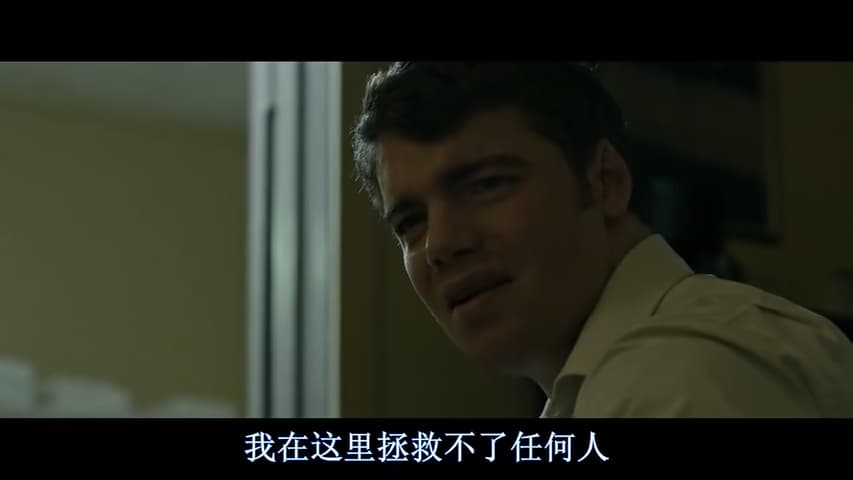
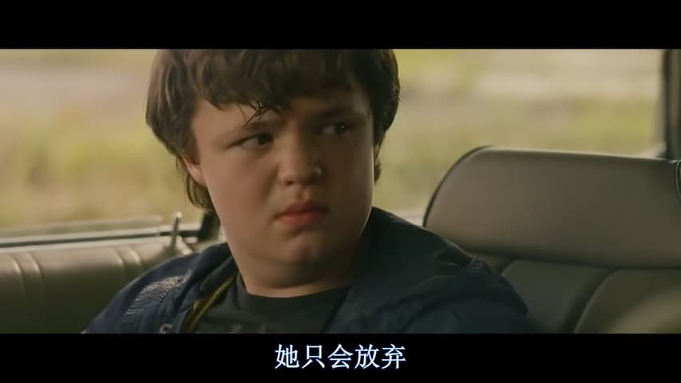
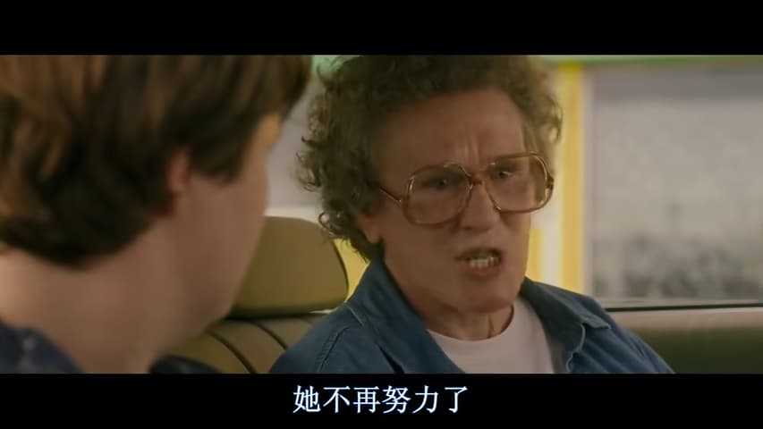
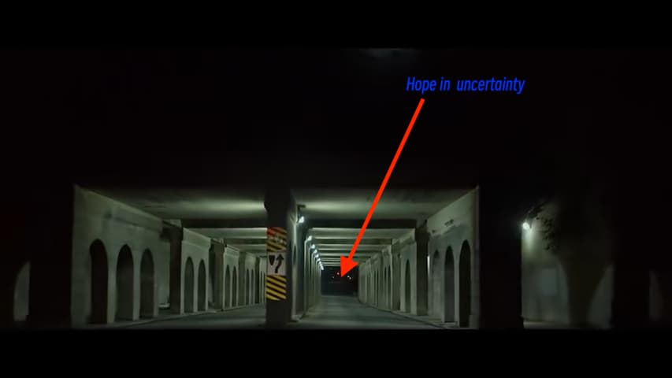

% 我在这里救不了任何人!
% 王福强
% 2024-07-21

乡下人的宿命好像都是一样的，不管是在哪个国家。

还是Netflix的《乡下人的悲歌》里的镜头：

要理解这个镜头，我们得"倒带"。(啥？你不知道啥是倒带？ 就是从前面开始重新播放，录像带📼时代的产物🤣)

首先是JD Vance的外婆评价她女儿（也就是JD Vance他妈）：

其次就是JD Vance想要把他妈送到条件好点儿的戒毒疗养所的时候，在前台刷卡的场景，“这个卡刷500美金，那个卡刷1000美金，那个卡刷...”

看出什么共同点了吗？

两代人的**疲于奔命**！ 加上他外婆，为了给他买德州仪器的计算器，只能央求发放救济的小哥儿多给一些计划外的食物，可以看出其实三代人都在**疲于奔命**。

她女儿不是只会放弃，而是持续的疲于奔命，根本没有放松的时候，心力被熬完了，“只会放弃”就是最自然的表现，实际上，她也不愿，奈何境遇如此...

所以，JD Vance能到今天，绝对是极其极其小概率的事件，都不得不感叹，**What a Lucky Guy**，能从hillbilly走到vice president，这一路走来，不说是如履薄冰，也是走错一步就又得一代人重启循环。

所以，他想清楚了，他不能呆在hill people里，因为呆在这里，他确实救不了任何人，所以，他毅然选择驱车上路：

