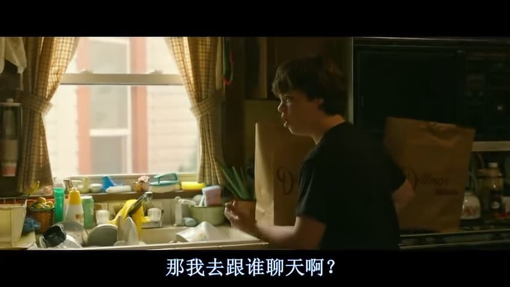

% JD Vance: 那我去跟谁聊天啊？
% 王福强
% 2024-07-21

今天「福宝集团」微信群里有同学推荐了「乡下人的悲歌」这部电影（Netflix出品），中午吃饭的时候看了下，里面有个镜头我觉得挺有意思，就是JD Vance的外婆把他的狐朋狗友都撵跑了之后，JD Vance很不愤的问她外婆：

她外婆让他跟自己聊，因为她就经常这么干。

> 谁是JD Vance？
> 
> 就是川普刚提名的那个副总统人选，同名书籍《乡下人的悲歌》（Hillbilly Elegy）的作者。

其实，每个人都会时不时的跟自己聊天，但这其实远远不够，外向型的人其实更喜欢跟不同的人聊天，内向的人则更多通过读书跟不同的作者聊天，比如我，就是后者。

周末两天把小马宋的另一本营销方面的书看完了，上一本读完之后，印象最深的是「标准石油，每桶4美元」的故事， 这本儿读完，印象最深的是关于价格谈判。

因为如果自己脑子没有坏掉的话，我记得在2008年花旗内部要求自学谈判基础的课程的时候，我记得的是尽量不要be first to offer，但小马宋的书里根据锚定效应的心理原理，却建议首先出价，而且说的听起来也很有道理。

后来我琢磨了一下，大体上想明白了到底是咋回事...

花旗那时候的谈判基础课程指的是一对一的场景，而小马宋书里的案例是“演双簧”卖货的场景（关于演双簧，到时候可以单独开一个话题，跟一人公司的劣势这个话题一起），前者**以退为进、以后为先**，后者**主动出击、预先设计**。

当然，只是个人的一个观察和思考，不一定对。 各位看官有啥高见，不妨评论区见咯 😉