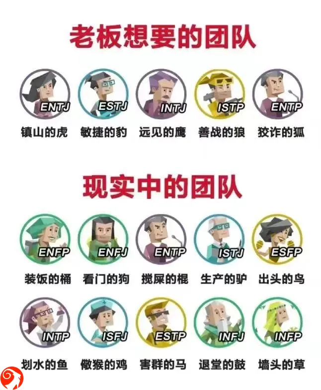

% 什么样的人适合当老板？
% 王福强
% 2024-08-05

为什么今天要聊这个问题呢？ 

因为在 X 上看到一条文字：

> 我真的哭死，群里有个伯伯的公司已经不赚钱很久了，但是他坚持开着，大家都不能理解，为啥不早点止损，他说自己又不差这点钱，继续把员工养着算了，他们现在失业的话根本找不到工作。

这个伯伯明显符合 MBTI 里的 F 型人的特征。 

进而让我想起这幅图：

MBTI 里一共 16 型人格，而这幅图里少了一个，大家猜猜是哪个？ 

对， 少了 ESFJ。

也就是这幅图假定老板大都是 ESFJ 型人格。

其实想想，也不无道理。

E 意味着这个老板是外向型人，那肯定跟人打交道精力旺盛，所以，广结善缘，生意场上人缘肯定不会太差；

S 意味着这个老板擅长抓细节，所以，不必要的跑冒滴漏基本不太可能发生，即使有，概率也很小了。甚至于有些老板抓细节能抓到什么程度，据说 excel 100 万条记录，跟团队一条一条地对数据...

F 意味着这个老板重感情，感情是纽带，容易团结人，不像马斯克，就是只重功劳不重苦劳的 T，所以，开掉了跟他苦干了 12 年的秘书一点儿都波澜不惊，让 F 们觉得太没人情味儿。

J 则意味着这个老板有目标感、有规划、擅抓执行，所以，团队绩效肯定不会太差， 相当于弥补了 F 的劣势（因为太过重感情，也会为这个特质所累）

当然，这不是算命，只能说，符合这样特质的人更适合做老板，而不是说其他特质的人就不能做老板，其实很多时候只是做的好坏的问题，而不是能不能干的问题。

另外就是，上面这张图纯粹是调侃性质的，大家也别太当真，要当真，可以去[「福强私学」](https://afoo.me/kb)的「[管理专栏」](https://kb.afoo.me/mgmt/mbti/)里看看正常的 MBTI 到底是怎么回事，毕竟，娱乐归娱乐，管理和做事还是得正式理解这个工具是怎么回事才行。

