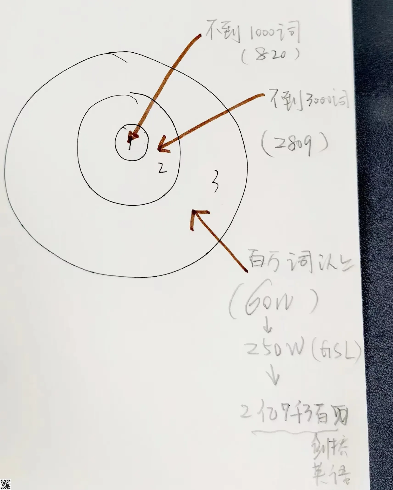

% 热衷英语教学？ 我有吗？
% 王福强
% 2024-08-08

新加入[「福强私学」](https://afoo.me/kb.html)的一位同学微信上问了我这么个问题：

```
福强老师为什么这么热衷英语教学[旺柴][旺柴]
```

我还感觉挺突兀的，其实，我只是这阵子在做一个事情，把 NGSL 里的常见词用自己的方式做个整理放到[「福强私学」](https://afoo.me/kb.html)的英语学习专栏里，至于“热衷”，可能是因为这阵子（有一个月了？）频繁更新的内容体现在了首页动态上😅



其实我倒是希望大家能学学英语，不为别的，就是多了个信源（信息源头），我们讲，“明智求实，明心求是”， 


如果只有单一信息源的输入，其实是很难做到的“明”的，毕竟，“兼听则明”，没有两个以上信息源，怎么兼呀，是吧？ （而且，你们不觉得“明”这个字很有意思吗？ 日和月加起来才叫“明”，你得白天黑夜都见过才算了解了一个完整周期不是？😉）

比如，我们经常说穷人怎么怎么样，其实不是穷，更多是贫，穷是没有出路，也就是 `dead end` 或者 `no way out`，贫才是资源匮乏，`poverty`。 

很多信息**对照着**看 [^1]，才能更明了，你说呢？

[^1]: 《深度思考揭秘》里不也提到了“对比”的重要性吗？


