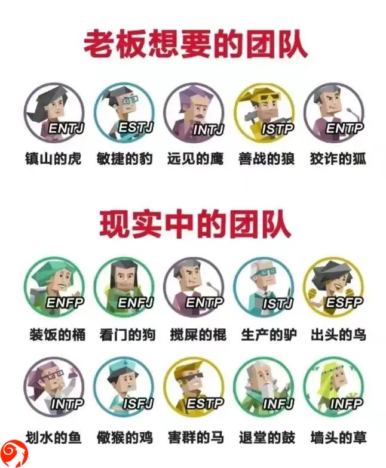

% 推荐两本书
% 王福强
% 2024-08-27

前阵子进入“生产队的驴”模式，这阵子感觉疲了，所以“生产队的驴”模式下线一下...

偷闲读完两本书，一本是《上瘾五百年》，这个是很早以前的书了，放在当当的购物车里很长时间，这个月扫单的时候一起下单了。

《上瘾五百年》这本书印象比较深的就是， “贩毒的从来不吸毒”，但会嚯嚯其它人。 整个全球瘾品史，既是经济贸易史，也是政治战争史， 禁止还是放行，绝大多数不是为了什么众人的福祉，而是税收或是成本。

假如一切都从生意出发，那么，反而是 more mess，more business, more business, more profit。 

假如你对人间一直都有美好的期望，那么，这本书会让你看到世间的另一面。

看的第二本书是《一如既往》，翻了下居然是 2024 年新出的书，其实也是一起扫货的，当时都记不得是因为啥加到购物车做 favorite 的。

这本书挺好，读得是心有戚戚焉，虽薄，但感觉值得放手边多翻几次。

当然，就像书里说的那样，如果你没经历过，其中很多内容可能会很无感，有了体感，感受就完全不一样了，所以， **Skin in the game** 很重要。这也是为啥[「福强私学」](https://afoo.me/kb.html)强调要 🖐️ **Learn by doing** & **Bring Memory to Muscle Memory** 💪

摘录《一如既往》里面三句话作为结束：

> 对那些希望听谎话的人撒谎，你会发财。
> 
> 对那些渴望真相的人说实话，你能谋生。
> 
> 对那些希望听谎话的人说实话，你会破产。

