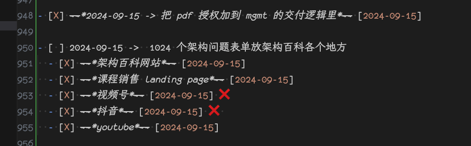

% 几个底层逻辑的小故事
% 王福强
% 2024-09-15

底层逻辑其实是一个很泛化的概念，比如刘润有本书叫《底层逻辑》，在西西弗线下溜达的时候，也看到很多本书叫底层逻辑，甚至于扶墙老师很多年前也做了一个视频叫「底层逻辑」（属于「福报」的一部分 https://fb.afoo.me）， 但实际上大家说得都不是一个东西。

所以，还是就细小而具体的故事和案例来谈底层逻辑，会更有意思一些吧！

## 一块钱的许愿

昨天刷到一个脱口秀的短视频， “很多小孩都是想要用很小的努力获得很大的成绩”， 没办法，人性本懒，而且往往还心存侥幸，所以，可能戒侥幸这事情得一辈子修行才行。 

扔一块钱到许愿池跟菩萨要200万，嗯，菩萨心想，我tmd不得亏死啊，你还是买彩票去吧，起码我还能歇歇，心还不累。🤣

## 道理与现实

嘴上天天喊“底层逻辑”也没鸟用，你得事儿上练啊！ 事虽小不为不成， 再琐细的事情，你不干，它还是个想法，时间过长了，习惯了，那就是空想。

所以，我比较喜欢华与华跟刘润对谈里面一句话，“每天有点儿产出物”。 （虽然当时他说话方式和神态估计让人不舒服，哈哈哈，但架不住这句确实match了我的日常practice）

## 客户第一还是自我第一

是不是觉得这篇思维混乱？ 

那就对了，其实原本也没啥主线。 

比如，这个章节，纯粹是为了跟你说明白，本篇是为了测试新的CSS设置，因为不止两三个同学反映说，我的公众号排版简直是惨不忍睹（虽然我自己看着还行，可能一直审美比较土鳖吧）， 所以，既然是公开发出来的内容，那还是客户第一吧，不放出来给人看的，自己再爱怎么弄怎么弄。

希望这个CSS设置会比之前排版有所改善🤣

