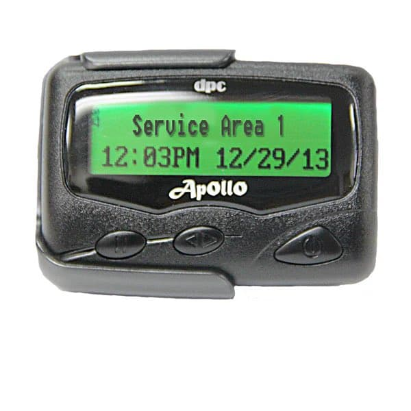

% 信息安全暗面下的两个小故事
% 王福强
% 2024-09-18

今天早上起来看到一条新闻，说是以色列特工在黎巴嫩真主党武装从台湾采购的一批 BB 机（Pager）中，安放了 1-2 盎司的炸药（一两左右）以及远程触发装置，然后在下午 3:30 分，真主党高层发送了一条消息之后，直接触发了爆炸，有死有伤 2000 多人。 

啥？ 你不知道啥是 BB 机？ 长这个样子：

当然，这不重要，重要的是，这不禁让我想起在[《做事逻辑》](https://wfq.gumroad.com/l/cogg)那个视频课里提到的一种做事思路，即 **Tag it**

BB 机充当了染色剂，在人群中标识出了区别于普通民众的真主党武装分子，之后，就可以精准操作了，yeesh...

话说，我们 20 年前的通信设备（BB 机），为啥他们还在用呢？ 重点就是安全。 虽然古老，但是有效。

现在特殊人群使用的通信设备其实也都已经更新换代了，比如早年有家加拿大的公司叫 Phantom Secure（幽灵安全），他们就在老的黑莓手机上进行定制，实现端到端的加密，表面上是宣传隐私安全，实际上都卖给了毒贩之类的犯罪分子，所以，后来就被 FBI 给干了。

但需求还在，所以，后面又出来一家Sky Global， 更是在苹果、安卓之类的智能手机上开干，把摄像头之类的功能都阉割掉，只留基础的端到端加密软件，甚至还加了伪装，不知道“芝麻开门”，你都进不去。

FBI 一看，这不行啊，跟 tmd 蟑螂似的，这哪儿打得完？ 

所以他们就策反了之前 Phantom Secure 的一个程序员，嗯，关键资产， 没高端程序员，搞鸡毛的安全端到端啊，🤣

为了减刑，这个程序员就跟 FBI 说，我可以加后门，这样你们就能监控聊天信息了，FBI 一看，这行啊，干！

但美国有法律不让监控公民手机通讯，所以，FBI 就把这套基础设施扔给了澳大利亚，你们来搞，回头把信息发给我来分析就行了， 澳大利亚说，行。

而且，为了放大效果，FBI 也上了商业手段，推出了自己的端到端加密安全手机ΛNØM，不要 3200 美金，不要 2500 美金，只需要 1700 美金，甚至还动用行政手段打掉了竞争对手，使得ΛNØM手机的市场份额一路高歌。

结局估计大家都猜到了，所有犯罪信息一览无余， 排坐坐吃果果吧🤣

