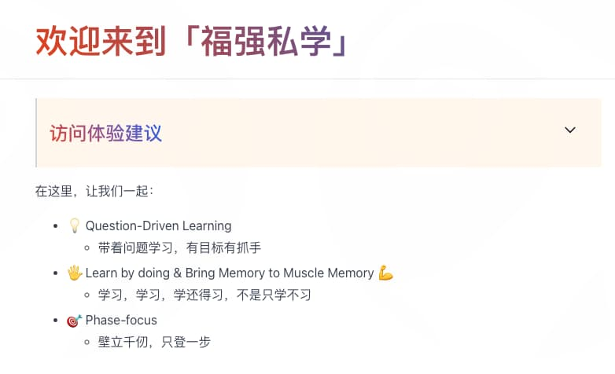

% 如何拥有犀利的思维？
% 王福强
% 2024-09-21

昨天在听主播「范谈商业」的直播，期间有个观众问了个有趣的问题，那就是如何拥有像（当事人）主播那样犀利的思维。

主播强调了一定要多读书，而且分享了好几本书，以及如何选书的七八条标准，我觉得挺好的，但不全面。

要拥有（当事人）主播那样犀利的思维，起码有三个因素不能忽略：

1. 天赋
2. 多读书
3. 多做事

## 天赋

这东西因人而异，没多说的必要，德尔斐神庙箴言里其中一条就是“认识你自己”，所以，你自己的天赋是什么，也在此列，自己探寻去吧😉

## 多读书

多读书其实有个前置条件，那就是多读**好**书。  出版社现在也是市场导向，如果奶头乐更有市场，销量更好，那肯定出版此类图书更多，商业导向，正常。 但个人要选书，那就得不能只图奶头乐了，那只会让你沉沦，又上哪儿去拥有犀利的思维呢？ 淅淅沥沥的思维吗？

主播分享了七八条选书标准，我记不清了，只留意了自己认同的三点（对，请叫我王三点）：

1. 出版社： 比如中信，因为有钱，所以，好书的版权一般都第一时间拿到，内容质量自然不用说；
2. 牛人推荐：这个不用多说了吧？ 加了背书的，别人替你先趟了一遍是浑水还是清水，你的筛选成本降低了；
3. 看参考资料是否详尽： 体现了作者和出版社的认真与专业程度 

主播也推荐了几本书，不过从我的角度来说，可能这几本书意义不大，比如，《如何提问》， 这本书我在高铁站读了十几页之后就读不下去了，没读完，所以也不好评价，但从个人角度（注意，纯个人观点）， 这本书有点儿跟之前我看到的一本书叫什么《深度思考：不断逼近问题的本质》很相似，标题党，抢占了个好书名， 其实内容很渣，甚至跟标题一点儿都不搭嘎，反正看完那本《深度思考：不断逼近问题的本质》，我直呼上当，太 tmd 渣了，跟深度思考没半毛钱关系，还不如我自己多年前写的[《深度思考揭秘》](https://afoo.me/books.html) 🤓

关于读书，个人倒是可以再补充一个点，那就是根据自己当下专注的问题和场景去选择书，而不是一股脑儿地洪水漫灌，那也失去了读书的意义。

读书，更多是跟不同领域的高手聊天（或者寻求信号刺激）， 更好的方式是跟现实中的高人聊，但你身边不一定有高人，就算有，人家凭啥要耗费时间跟你聊？ 所以，读书反而是成本最低，效果最好的跟高人聊的替代了。

## 多做事

其实主播没有说出他思维犀利的关键因素，那就是多做事。

一个把一个业务、一个项目从 0 到 1 做成了还把公司上市/被收购整个闭环打完的人， 整个做事过程中锻炼出来的思维习惯，自然犀利咯～

当然，多做事，更指那种从调研、规划、推动、落实整个闭环做下来的做事，而不是被动接受任务的做事，后者即使用到了脑子，也只是用到了直觉层面，而不是思考层面，比如送卖外、跑网约车等，这种事情做再多，可能跟锻炼犀利的思维也没太大关系。

所以，多做事，在做事的过程中感悟、改善、思考，久而久之，犀利的思维也就慢慢形成了。

在[「福强私学」](https://afoo.me/kb.html)里，我们也提倡多做事，不但要有 memory 还得要有 muscle memory：

## 后话

要练就犀利的思维，其实就是软硬兼施、刚柔相济， 光多读书难免落入虚无， 光多做事又难免陷入偏执， 二者交叉融合，方为大用。

祝早日练就犀利的思维 🤓

