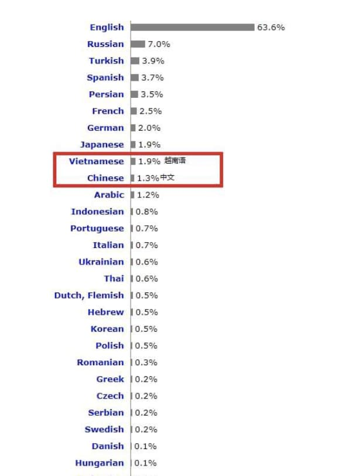
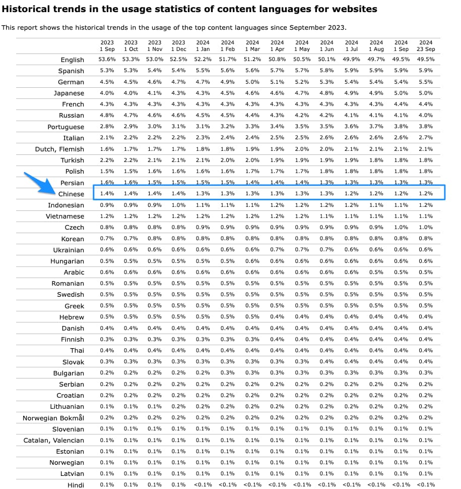

% 中文内容的质量、分布与创作激励
% 王福强
% 2024-09-23

原文链接：[中文内容的质量、分布与创作激励](https://kb.afoo.me/cognition/shorts/%E4%B8%AD%E6%96%87%E5%86%85%E5%AE%B9/)

在一个企业家群里，有人说“中文随着AI发展 会不会 以后对人类影响越来越弱...”， 然后有人跟进“我说一句，中文在世界的信息重量中只有1.5%”，还顺带加了个图：

其实这个结论对不对呢？

这要看你的关注点到底是在中文还是在网站。 🤣

怎么说？

如果你的关注点是在中文，那么，中文的内容其实应该不是在减少，而是一直在增加，如果是你的关注点在网站，那么，网站的数量肯定在下降，进而网站呈现的内容也是在下降，比如中文技术内容对世界范围的技术内容走向趋势如下（来源 → https://w3techs.com/technologies/history_overview/content_language）：

这就牵扯出第二个问题，内容的分布方式。

世界范围内，网站依然是主流的信息渠道， 但中文范围内，APP 显然是主流媒介，比如小红书就是这些年突然爆火的内容社区（原来做海淘起家）， 而各家 APP 其实一直在持续运营内容，相应的，中文内容也一直在各家 APP 内茂盛地生产，肯定不是在减少。

但是，话又说回来了，虽然 APP 内中文内容在持续生产，总体上中文内容也是在持续增长，但中文内容的结构和偏重跟一些世界范围内的统计是不一样的。 吃喝拉撒、生活娱乐，应该在中文内容里占了大头儿，而像上面对技术内容的贡献，中文肯定是占小头儿。 

这就牵扯出第三个话题，内容创作的激励机制。

个人兴趣创作的内容永远无法形成有效的影响力，所以，即使是此类内容，也要通过平台的聚合才能产生整体上的影响力， 抛开 APP 不算（大多是内部电商或者生活娱乐类内容的运营）， 网站内容的运营，大多还是走 PageRank 算法， 这个时候，要想在搜索引擎的“淫威”下存活还要活得更好，那就得迎合算法，而不是按照自己的兴趣来创作内容。

所以，这就导致很多内容的生产其实依然是按照用户喜好来的（道理不变，咪蒙从文字被封杀到短剧再起飞，依然是因为她懂得中文世界里大多数基本盘的人性弱点）， 那你说这些内容的质量是好、是坏呢？ 起码在算法的眼里，这些都是好的内容。  （相应的，在不需要或者不喜欢这些内容的人眼里，这些都是垃圾）

再有就是，即使是搜索引擎，面向 Google 和面向百度的玩法也是不一样的， 前者严格遵守算法规则做运营，后者更多靠用户花钱搞 SEM（付费排名）来赚钱， 所以，用户主动检索到的有效信息筛选成本也是不一样的。假如是广告主发钱让百度分发内容，那用户检索到的信息，更大概率是广告主想要用户看到的信息，而不是用户自己想要看到的信息（因为免费嘛，相当于要花更多时间和精力作为补偿成本）。

所以，最后总结一下：

- 中文网站的数量应该是一直在下降的，所以基于中文网站做中文内容的数据统计，那么大概率情况下，趋势也是逐年下降的，不管什么领域；
- 中文内容的分布除了网站，还有国内各家 APP， 而他们的分布反而成了 2和 8，甚至更大的分化比例（比如 1 比 9），总之，在中文内容的分发渠道里， 世界范围内流行的网站反而成了小卡拉咪；
- 中文内容的创作，更多基于商业层面的考虑和投入，至于这些内容是好是坏，完全凭用户自己决定，而用户是分不同圈层的，好坏在不同圈层里大概率会是众口难调，所以，各位还是自求多福吧， 自己需要啥，自行筛选取用。

