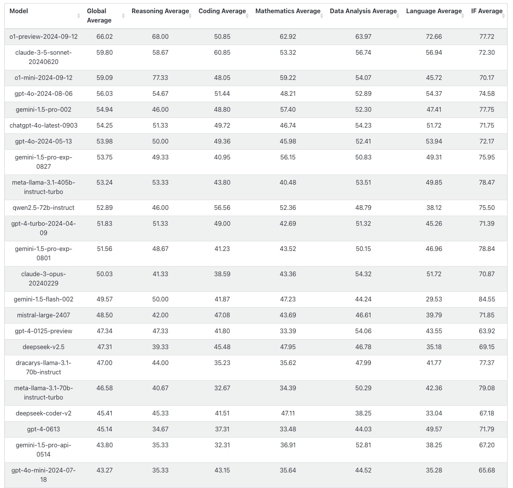

% 如何选择或者搭建合适的AI大语言模型服务？
% 王福强
% 2024-09-25

昨天有 CEO 跟我咨询AI 的大语言模型服务的访问与搭建问题，鉴于他没交咨询费，我只只能写公关稿来放大价值了😉

他们原来通过新加坡绕路访问海外的AI 大语言模型服务，但丢包率很高，严重影响产品体验，鉴于他们的团队结构短板以及他们的业务场景，我建议他们直接选择国内的 AI 大语言模型服务就可以了，因为随着开源大语言模型的释出， 以及算力瓶颈的逐渐缓解， 国内的各大厂商的AI大语言模型其实基本也够用了， 而且，假如公司的业务要持续在国内转，那 AI 大语言模型的监管与合规也是一个绕不过去的事情，而各大厂商已经帮我们做了这个事情，所以，直接用国内各大厂商的 AI 大语言模型服务就可以了。

当然，海外的 AI 大语言模型就不能用了吗？ 也不是，其实都能用。 福强老师给你个原则：

**用户场景用内部模型， 作业场景用外部模型。**

那就算用国内的大语言模型，应该用谁家的呢？

这个嘛，一个看**主次**，一个看个性，怎么理解？

看主次就是看排名嘛， AI 大语言模型这么些家，肯定不好选嘛，既然问题都是共通的，那就有人会解决这个问题，比如国外很多地方搞的 leaderboard（排行榜），就是很好的参考啊：

老老老东家的千问看来排到前十名以内了，可以重点考虑啊， 其他都是国外的。

除了主次，还有就是根据自己的业务场景去选择不同模型， 因为不同模型从数据集到训练都有各自不太一样的地方，这个效果怎么样，就得贴和自己业务场景来测试和验证了。

嗯，基本上就这点儿东西， 都是定性层面，定量就得耗费工时了，你们自己来吧～

另外，明眼的同学应该发现了， 整个思维框架其实就是福强私学的十二字真言的前面六个字。 啥？ 少了“**先后**”两个字？ 其实没少啦， 不知道**先后**，又怎么会指导你如何选择呢？ 😉

