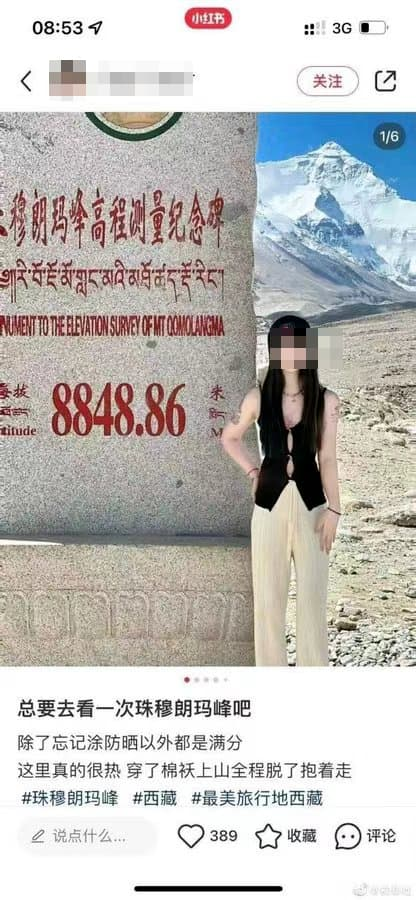

% 你的认知决定你的常识！
% 王福强
% 2024-09-26

网上看到一张图：

打眼一看，第一感觉是 P 的，不管是用传统 Photoshop 还是新潮 AI 工具，但细一打量，才发现亮点在哪儿...

这个海拔，要是真敢穿夏装，那真是勇士啊！！！

这让我想起阿朱之前说：

> 我想起我没有去西藏之前听到的一个段子：说牧民们8点起床了也不干活，先喝茶念经，10点才开始干活。我心想：咋这么好的生活呢[偷笑]
> 
> 后来去了西藏了才发觉：这是由中国统一时间度量衡制度造成的，北京时间的8点，西藏那边还黑着呢，当然没法干活，只能喝茶念经。[偷笑]
> 
> 段子误人。

很多时候，如果没有到过现场，其实是很难理解甚至认识到哪些东西是荒谬的、臆想的。 这也是为啥经营之神强调“真神在现场”的原因，**现场**很重要！

没有到现场，多读读书也有些用，起码 8848 这个海拔跟气温什么关系，应该还是可以了解的。

不免感叹，什么认知就有什么常识，所以，常识对每个人来说其实都是不一样的。

之前很不理解： 为什么自己觉得是常识的东西，别人就是不理解呢？现在都释然了，因为每个人都有自己的南墙要撞 🤣

