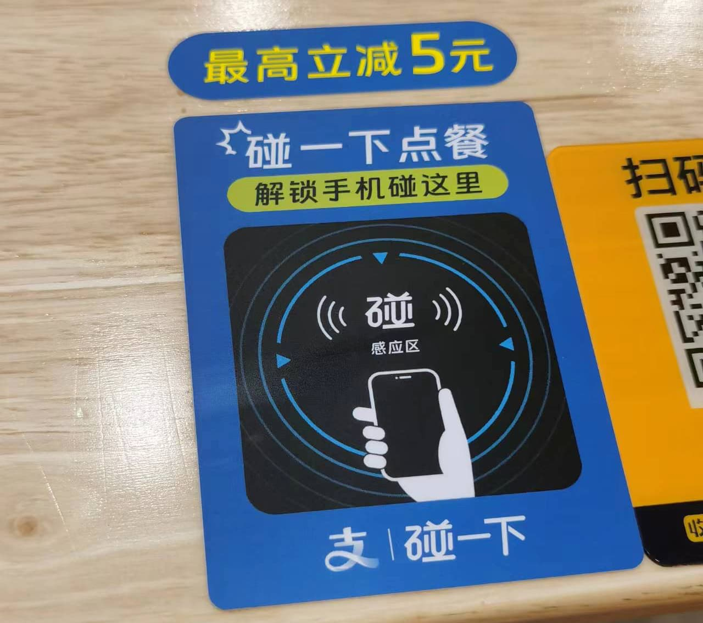

% 线下 NFC 点餐的技术、产品与商业思考
% 王福强
% 2024-09-27

今天吃饭的时候，发现经常吃鸡蛋炒年糕这家店的桌子上多了个 NFC 的点餐卡片：

本着研究技术和产品都思路，走了遍流程，遂简单记录下。

## 技术层面

桌面上只能贴没有能源的卡（card），所以，桌面上应该就是只是贴了个标识性的 NFC 标签，当有 NFC 支持的手机靠近之后，会拉起支付宝小程序（对，支付宝的小程序，不是微信的小程序）， 然后，点单内容跟微信扫码后拉起的小程序类似，应该是商家多个平台一起发布同一个小程序（这也算常规操作了）， 我也是两个流程都走了一遍才验证说是不同的小程序，这界面上太 tmd 的像了， 我又没法抓包分析，也没法下拉看 URL，只能从界面上的蛛丝马迹找差别了， 配合手机都 dock 功能验证，才确定是拉起的支付宝的小程序。

这个技术层面没啥好谈的，小程序是现成的， 无非多了个 trigger 而已。

## 产品层面

从流程上来看，基于 NFC 的方式比扫码点单的流程步骤上要短。

手机放上就拉起了支付宝小程序，而扫码则需要打开手机，打开微信（或者长按微信）， 扫码，然后拉起微信小程序， 所以，后者从步骤上来说多了 1-2 步， 从人性本懒的角度来说，前者胜。

但并非所有手机都有 NFC 支持，所以，扫码方式胜在旧有的习惯以及兼容性。

本回合打平， draw game～

## 商业层面

跟老板简单聊了几句， 这个 NFC 的卡片是支付宝推广的时候免费给贴的，还送台面上的 NFC 收款设备， 从老板角度来说，既然是免费，那也就不纠结了，要是收费的话，他肯定就不干了，毕竟，街边的小本生意，能省就省了，本来也是到店消费，多一个支付渠道无关痛痒，但从支付宝角度，则是分存量市场的斗争咯～ 

商战就是这么在线下朴实无华。

