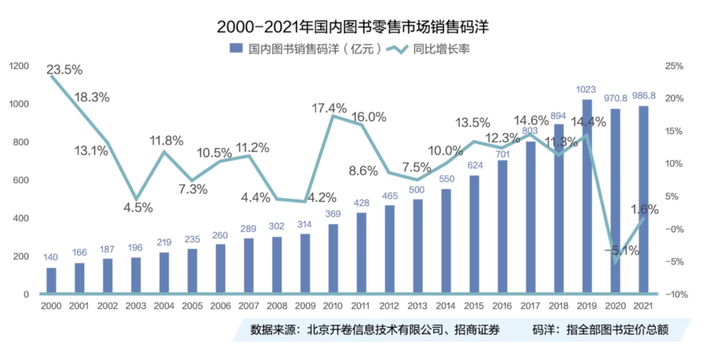

% 真的吗? 现在基本上没有人读书了?
% 王福强
% 2024-09-28

前几天有人在"福报集团"群里说:

> 现在基本上没有人读书

真的如此吗? 

昨天花了1499大洋买了个训练营，今天花了一天把主体视频内容都扫完了一把，里面有个项目拆解，正好跟书有关，里面有张插图，正好可以说明这个问题，毕竟，数据和银子是诚实的:

其实整个图书市场只是在2019年码洋冲高到1000亿之后下落了一年(什么原因大家应该都亲身经历过了)，之后是慢慢恢复的，所以，整个图书市场其实是在增长的，只不过，可能生产与分发形式都发生了变化。

比如，现在很多人买书更多可能是先通过短视频了解，之后在下单后细读（或者弃而不读，反正已经买了），　还有人买的可能是电子书或者其它内容产品（比如[福强私学](https://afoo.me/kb.html)😉）。

像得到、樊登、喜马拉雅这类，其实都算是图书市场的一分子。

当然，也不得不说，从总量上来说，读书的人占比肯定是小的。

这个从网红的粉丝数量与一般博主的粉丝数量就能看出来，像司驴南的受众，　其实都是不读书的，否则，他也不至于带货图书没卖掉几本儿。

但也有一周读四本书的人，所以，不是基本上没人读书了，可能仅仅是自己身边基本上没人读书了，或者用其它形式替代读书了，比如改听书了。

其实，吃喝玩乐的人一直在，读书的人也一直在，只不过换换代际，换换形式而已。

那么，你是喜欢读书的人吗？　

最近在读什么书呢？　评论区打出来吧～

