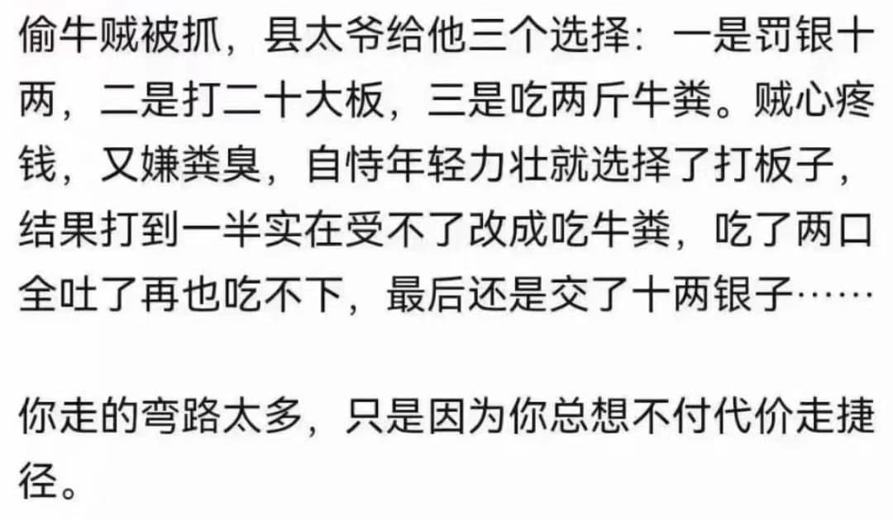

% AI都这么厉害了，我为啥还需要花钱找你咨询？
% 王福强
% 2024-09-29

这是在别人的直播间听连麦的同学问主播的问题，而且，TA还表达了之前花了2000多买了李S友的课，也学习了，但好像没啥鸟用。

针对这个问题，我谈谈个人观点。

首先，选课要从个人现状出发，其次，要了解课程是否适合你。 李S友机构的课其实并不适合SMB企业，更不适合个人， 他们更多还是在讲道层面的东西，讲战略，讲文化，这些务虚的东西不是没有用，而是对于非大型企业来说没什么用。

再有，AI虽然很厉害了，但其实还是给不了你某些特殊的价值，尤其是当你了解AI的底层逻辑是什么的时候。

今天的AI，其实大家更多是在指大语言模型，但基础模型怎么来的？ 公开信息。 可是，很多有价值的信息会公开吗？ 为什么海外最牛逼的大语言模型定价也就20美金一个月，而一对一咨询要定价1000-2000？！ 想想背后的差异在哪儿？ 真的是在割韭菜吗？

另外，听了几个连麦的同学提问的内容，感觉都想要通过一次连麦解决一个业务问题甚至搞定一个商业项目的成功运营， 这一听就是对做成一个事情没有体感，正好今天「福宝集团」群里有同学分享了个截图，感觉挺能说明问题的：

没遭受现实的毒打， 又怎么会老老实实交学费？ 🤣

其实很多时候， 起步与成长期，更多还是追求战术与试错效率， 小术难求，就是说的这个事情， 等做起来了，资源多了，安全垫厚了，那时候就可以多谈点儿道了。

你说这些 AI 会指导你吗？ Day dream！ 🤣

最前沿、最核心、最有价值的信息，除非所有权人同意，否则进不了AI模型的，这就是为什么AI都这么厉害了，你还要花钱找咨询。 天上不会掉馅儿饼，不是所有东西都能等来免费的，因为你等来的免费也是之前哪位金主有钱而已，而且就算金主有钱让你享受免费，TA 也有自己的诉求。 免费还想领导好东西？ Day dream！🤣

---

最后打个广告：

- 如果你想简单了解下AI通识，避免现在媒体给你制造的AI恐慌，那么推荐福强老师的[「AI通识课」- https://xiaobot.net/p/aifd](https://xiaobot.net/p/aifd)； 
- 如果你想深入了解AI，那么可以考虑入手[「福强私学」- https://afoo.me/kb](https://afoo.me/kb), 在AI专栏有针对LLM和Stable Diffusion等不同领域的理论与实践体系化课程（视频课哟）；

哦，对，也欢迎遇到困难和疑惑，[找我咨询 - https://c.afoo.me](https://c.afoo.me)

